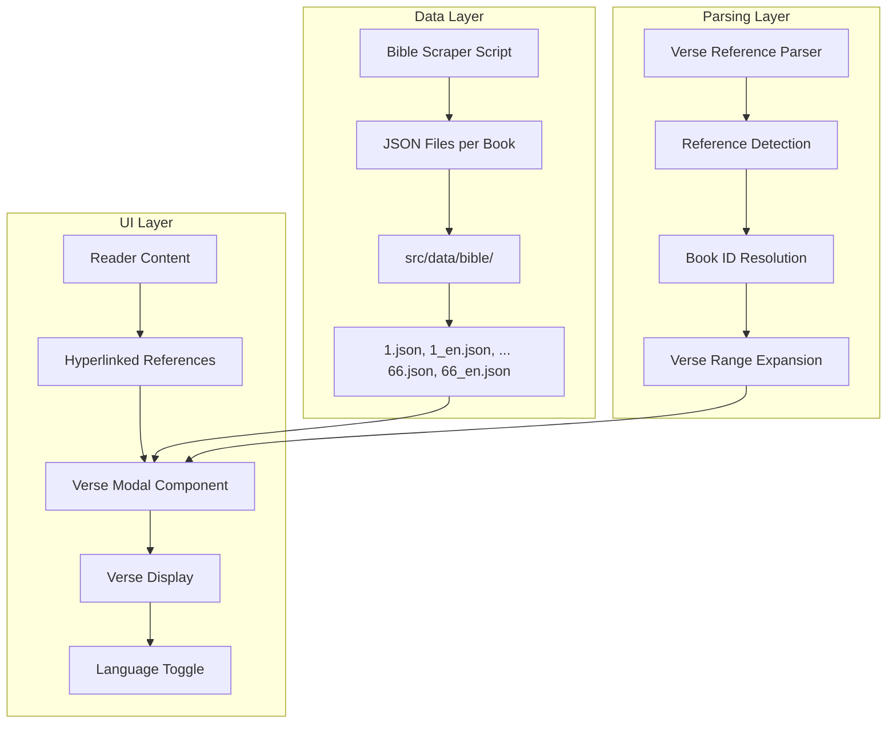

# Bible Verse Modal Feature - Technical Architecture Plan

## Overview

This plan outlines the implementation of a full-stack feature to display quoted Bible verses in a modal window within the Life Study Reader application. The feature includes:

1. Web scraper for Recovery Version Bible text (Traditional Chinese & English)
2. Bible verse reference parsing and hyperlinking utility
3. Responsive modal component for verse display

---

## Architecture Overview



---

## Phase 1: Bible Data Scraper

### 1.1 Target Source

**Website:** https://recoveryversion.bible/

The official Recovery Version Bible website provides:
- Traditional Chinese (聖經恢復本)
- English Recovery Version
- Clear verse-by-verse structure

### 1.2 Scraper Architecture

**File:** `scripts/crawler-bible.js`

```javascript
// Structure similar to existing crawlers
const axios = require('axios');
const cheerio = require('cheerio');
const fs = require('fs');
const path = require('path');

// Configuration
const BASE_URLS = {
  chinese: 'https://recoveryversion.bible/scripts/',
  english: 'https://recoveryversion.bible/scripts/'
};

// Book list matching existing book-names.ts IDs
const BOOK_IDS = ['1', '2', '3', ..., '66'];
```

### 1.3 Data Structure

**Directory:** `src/data/bible/`

**File naming convention:**
- Chinese: `{bookId}.json` (e.g., `1.json` for Genesis)
- English: `{bookId}_en.json` (e.g., `1_en.json`)

**JSON Schema:**

```json
{
  "bookId": "1",
  "bookName": "創世記",
  "chapters": [
    {
      "chapter": 1,
      "verses": [
        {
          "verse": 1,
          "text": "起初神創造諸天與地。"
        },
        {
          "verse": 2,
          "text": "而地變為荒廢空虛，淵面黑暗。神的靈運行在水面上。"
        }
      ]
    }
  ]
}
```

### 1.4 Scraper Implementation Details

The scraper will:
1. Iterate through all 66 books using book IDs from [`lib/book-names.ts`](lib/book-names.ts)
2. For each book, fetch all chapters
3. For each chapter, extract all verses with verse numbers
4. Handle both Chinese and English versions
5. Include rate limiting and error handling
6. Support resumable downloads with progress tracking

**Progress file:** `progress-bible.json` (similar to existing `progress.json`)

---

## Phase 2: Verse Reference Parsing System

### 2.1 Reference Patterns to Support

The Life Study content contains various Bible reference formats:

**English Format:**
- Single verse: `Gen. 1:1`, `John 3:16`
- Verse range: `Gen. 1:1-3`, `Heb. 1:1-2`
- Multiple verses: `Num. 1:1-4, 42-46`
- Chapter reference: `Gen. 1`, `Matt. 23`
- Multiple books: `Gen. 1:1; Exo. 20:1`

**Chinese Format:**
- Single verse: `創一1`, `約三16`, `提後三16`
- Verse range: `創一1～3`, `來一1～2`
- Multiple verses: `民一1～4、42～46`
- Chapter reference: `創一`, `太二十三`

### 2.2 Parser Module Structure

**File:** `lib/bible-reference-parser.ts`

```typescript
// Types
export interface BibleReference {
  bookId: string;           // Book ID matching book-names.ts
  chapter: number;
  verseStart: number;
  verseEnd?: number;        // For ranges
  originalText: string;     // Original matched text
  language: 'english' | 'chinese';
}

export interface ParsedContent {
  text: string;
  references: BibleReference[];
}

// Main parsing function
export function parseBibleReferences(
  text: string,
  language: 'english' | 'chinese'
): ParsedContent;

// Verse expansion for comma-separated references
export function expandVerseRanges(
  verseString: string
): Array<{ start: number; end?: number }>;
```

### 2.3 Book Abbreviation Mapping

Extend existing [`lib/tts-preprocessor.ts`](lib/tts-preprocessor.ts:70-93) mappings:

```typescript
// English abbreviations (from recoveryversion.bible style)
const ENGLISH_ABBREVIATIONS: Record<string, string> = {
  'Gen.': '1', 'Ex.': '2', 'Lev.': '3', 'Num.': '4', 'Deut.': '5',
  'Josh.': '6', 'Judg.': '7', 'Ruth': '8', '1 Sam.': '9', '2 Sam.': '10',
  '1 Kings': '11', '2 Kings': '12', '1 Chron.': '13', '2 Chron.': '14',
  'Ezra': '15', 'Neh.': '16', 'Esth.': '17', 'Job': '18', 'Ps.': '19',
  'Prov.': '20', 'Eccl.': '21', 'Song': '22', 'Isa.': '23', 'Jer.': '24',
  'Lam.': '25', 'Ezek.': '26', 'Dan.': '27', 'Hos.': '28', 'Joel': '29',
  'Amos': '30', 'Obad.': '31', 'Jonah': '32', 'Mic.': '33', 'Nah.': '34',
  'Hab.': '35', 'Zeph.': '36', 'Hag.': '37', 'Zech.': '38', 'Mal.': '39',
  'Matt.': '40', 'Mark': '41', 'Luke': '42', 'John': '43', 'Acts': '44',
  'Rom.': '45', '1 Cor.': '46', '2 Cor.': '47', 'Gal.': '48', 'Eph.': '49',
  'Phil.': '50', 'Col.': '51', '1 Thess.': '52', '2 Thess.': '53',
  '1 Tim.': '54', '2 Tim.': '55', 'Titus': '56', 'Phlm.': '57', 'Heb.': '58',
  'James': '59', '1 Pet.': '60', '2 Pet.': '61', '1 John': '62',
  '2 John': '63', '3 John': '64', 'Jude': '65', 'Rev.': '66'
};

// Chinese abbreviations (existing from tts-preprocessor.ts)
const CHINESE_ABBREVIATIONS: Record<string, string> = {
  '創': '1', '出': '2', '利': '3', '民': '4', '申': '5',
  '書': '6', '士': '7', '得': '8', '撒上': '9', '撒下': '10',
  // ... full mapping
};
```

---

## Phase 3: Verse Modal Component

### 3.1 Component Structure

**File:** `components/reader/verse-modal.tsx`

```typescript
interface VerseModalProps {
  open: boolean;
  onOpenChange: (open: boolean) => void;
  reference: BibleReference | null;
  language: 'english' | 'chinese' | 'simplified';
}
```

### 3.2 UI Design


**Key Features:**
- Responsive design (mobile-friendly)
- Language toggle (EN/繁/简) matching existing reader settings
- Verse numbers in superscript
- Smooth animations using existing Dialog component
- Keyboard navigation support
- Loading states for async verse fetching

### 3.3 Styling Approach

Using existing Tailwind CSS patterns from the project:

```typescript
// Verse styling
const verseStyles = {
  container: "p-4 md:p-6 max-h-[70vh] overflow-y-auto",
  verseText: "text-base md:text-lg leading-relaxed",
  verseNumber: "text-xs text-muted-foreground align-super mr-1",
  header: "text-lg font-semibold mb-4"
};
```

---

## Phase 4: Integration with Reader

### 4.1 Content Processing Pipeline


### 4.2 Modified Components

**Update [`components/reader/reader-content.tsx`](components/reader/reader-content.tsx):**

1. Import verse parser utilities
2. Process paragraph text before rendering
3. Wrap detected references in clickable `<button>` elements
4. Handle click events to open modal

**Update [`components/reader/reader.tsx`](components/reader/reader.tsx):**

1. Add verse modal state management
2. Include `VerseModal` component
3. Pass current language setting to modal

### 4.3 State Management

```typescript
// In reader.tsx
const [verseModalOpen, setVerseModalOpen] = useState(false);
const [selectedReference, setSelectedReference] = useState<BibleReference | null>(null);

const handleVerseClick = (ref: BibleReference) => {
  setSelectedReference(ref);
  setVerseModalOpen(true);
};
```

---

## Phase 5: Data Loading Strategy

### 5.1 Lazy Loading Approach

To optimize performance:
- Bible data loaded on-demand (not bundled)
- Only load book JSON when verse from that book is requested
- Cache loaded books in memory

### 5.2 API Route Option (Alternative)

**File:** `app/api/bible/[bookId]/route.ts`

```typescript
export async function GET(
  request: Request,
  { params }: { params: { bookId: string } }
) {
  const data = await import(`@/data/bible/${params.bookId}.json`);
  return Response.json(data);
}
```

---

## Implementation Timeline

| Phase | Task | Priority |
|-------|------|----------|
| 1 | Bible scraper script | High |
| 2 | Parser utility | High |
| 3 | Modal component | High |
| 4 | Reader integration | High |
| 5 | Testing & edge cases | Medium |

---

## Edge Cases to Handle

1. **Invalid references:** Display "Verse not found" message
2. **Missing book data:** Show loading indicator, fetch asynchronously
3. **Malformed references:** Skip parsing, display as plain text
4. **Very long passages:** Limit display, add scroll
5. **Multiple references in one paragraph:** Handle all individually
6. **Cross-chapter references:** e.g., "Gen. 1:31 - 2:3" (split into two requests)

---

## Testing Strategy

1. **Unit tests for parser:**
   - Test all reference format variations
   - Test edge cases (invalid input, partial matches)
   - Test both Chinese and English patterns

2. **Integration tests:**
   - Test modal opens with correct verse
   - Test language switching
   - Test verse range display

3. **E2E tests:**
   - User clicks verse link
   - Modal displays correct content
   - Works on mobile devices

---

## Dependencies

No new npm packages required. Using existing:
- `axios` - HTTP requests for scraper
- `cheerio` - HTML parsing for scraper
- `@radix-ui/react-dialog` - Modal component
- Tailwind CSS - Styling

---

## File Structure Summary

```
scripts/
  crawler-bible.js          # Bible scraper script

src/data/bible/
  1.json                    # Genesis (Chinese)
  1_en.json                 # Genesis (English)
  2.json                    # Exodus (Chinese)
  ...                       # All 66 books x 2 languages
  66_en.json                # Revelation (English)

lib/
  bible-reference-parser.ts # Verse parsing utilities
  bible-data.ts             # Data loading utilities

components/reader/
  verse-modal.tsx           # Modal component
  reader-content.tsx        # Updated with verse links
  
app/api/bible/[bookId]/
  route.ts                  # Optional API route
```

---

## Next Steps

1. Review and approve this plan
2. Switch to Code mode for implementation
3. Begin with Phase 1 (Bible scraper)