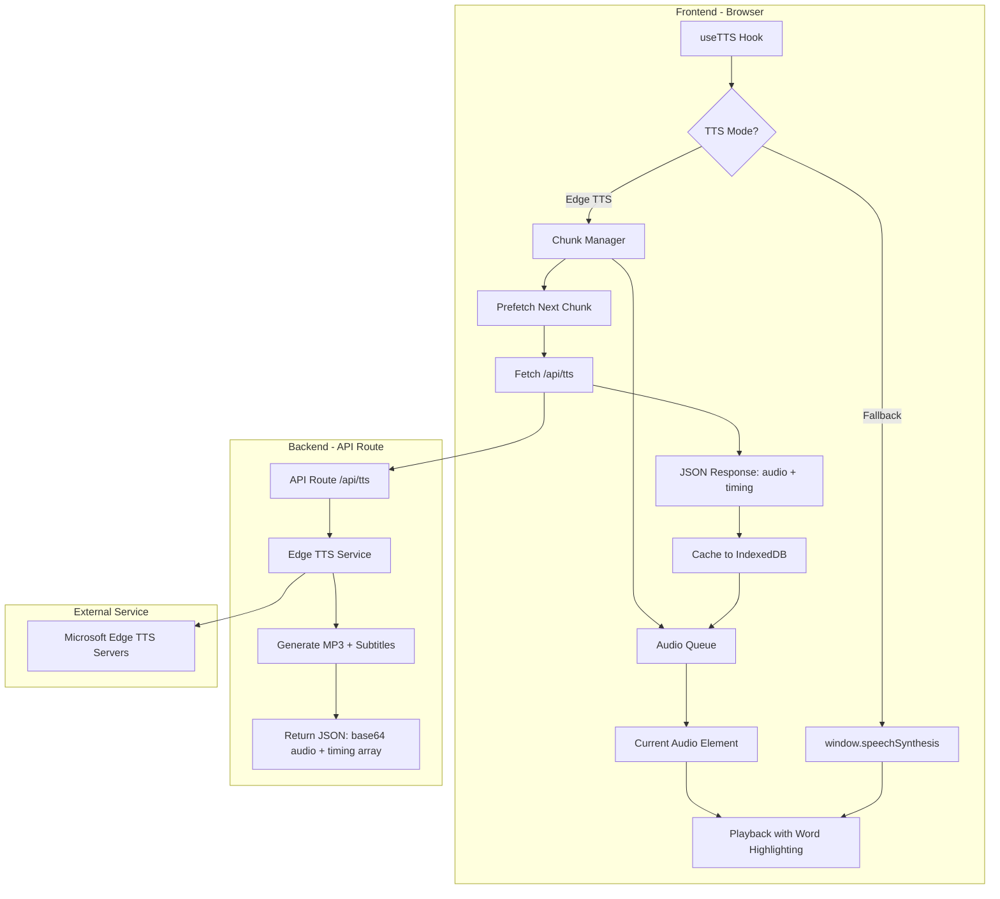
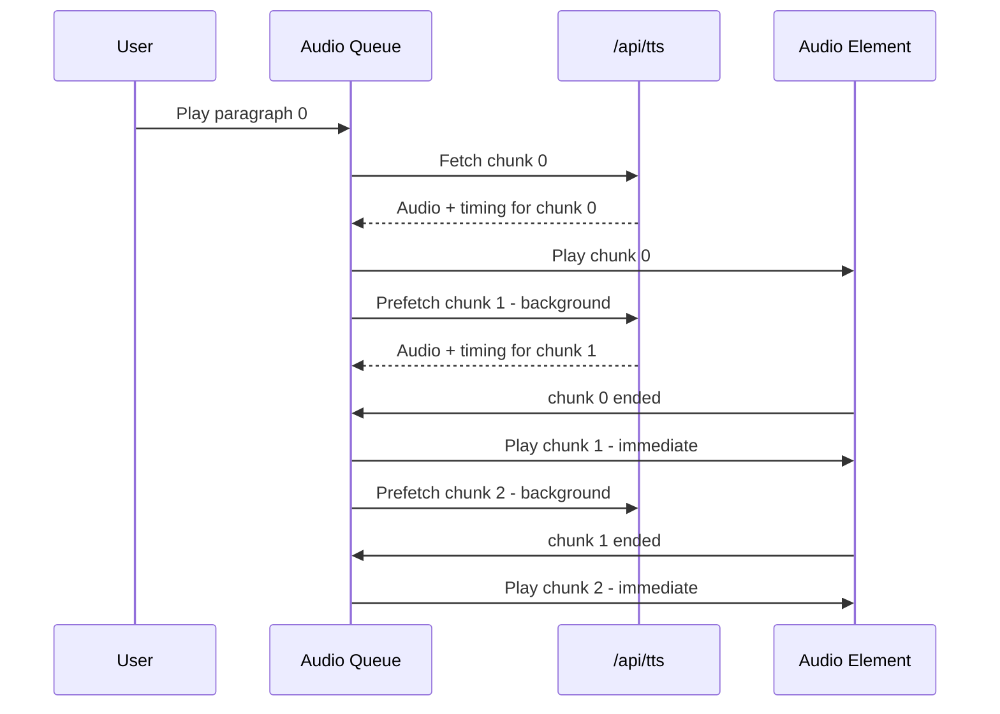

# Edge TTS Migration Plan

## Executive Summary

Migrate the Life-Study Reader's Text-to-Speech feature from browser `window.speechSynthesis` to Microsoft Edge TTS for significantly higher naturalness at zero cost.

## Current Architecture

### Files Involved
| File | Purpose | Lines |
|------|---------|-------|
| `hooks/use-tts.tsx` | Main TTS hook with `SpeechSynthesisUtterance` logic | 658 |
| `lib/tts-types.ts` | Type definitions for TTS state and settings | 148 |
| `lib/tts-storage.ts` | Voice selection, settings persistence | 365 |
| `lib/tts-preprocessor.ts` | Text preprocessing | 925 |
| `components/reader/tts-controls.tsx` | Play/pause/stop UI controls | 181 |
| `components/reader/tts-settings-panel.tsx` | Voice selection and settings panel | 343 |
| `components/reader/reader.tsx` | Main reader component integrating TTS | 1479 |

### Current Implementation
- Uses `SpeechSynthesisUtterance` with system OS voices
- Language-specific voice preferences (Traditional/Simplified Chinese, English)
- Text preprocessing for Bible references, polyphonic characters
- Position tracking for word highlighting
- Auto-continue to next message feature

---

## Target Architecture

### Voice Mappings

```typescript
const EDGE_TTS_VOICES = {
  // English (US)
  'en-US': {
    female: 'en-US-AriaNeural',
    male: 'en-US-ChristopherNeural',
  },
  // Simplified Chinese (Mainland)
  'zh-CN': {
    female: 'zh-CN-XiaoxiaoNeural',
    male: 'zh-CN-YunxiNeural',
  },
  // Traditional Chinese (Taiwan)
  'zh-TW': {
    female: 'zh-TW-HsiaoChenNeural',
    male: 'zh-TW-YunJheNeural',
  },
  // Traditional Chinese (Hong Kong) - Cantonese
  'zh-HK': {
    female: 'zh-HK-HiuMaanNeural',
    male: 'zh-HK-WanLungNeural',
  },
}
```

### System Architecture



### Key Architecture Decisions

#### 1. Word Boundary Timing (Accurate Highlighting)

The `edge-tts` library provides subtitle metadata with exact word timing. The API will return:

```typescript
interface TTSResponse {
  audio: string        // Base64 encoded MP3
  timing: WordTiming[] // Exact word boundary data
}

interface WordTiming {
  text: string         // The word/character
  start: number        // Start time in seconds
  end: number          // End time in seconds
}
```

This enables precise word highlighting synchronized with audio playback.

#### 2. Text Chunking Strategy (Timeout Prevention)

Long texts are split into manageable chunks to prevent timeouts:

- **Chunk Size**: Single paragraph (or ~500 characters max)
- **Audio Queue**: FIFO queue managing pre-fetched audio chunks
- **Prefetching**: While chunk N plays, chunk N+1 is fetched in background
- **Seamless Playback**: Next chunk starts immediately when current ends



### Deployment Considerations

#### For Vercel/Cloudflare Deployment

The `edge-tts` npm package requires Node.js runtime. For serverless deployment, we have two options:

**Option A: Use Node.js Runtime (Recommended for Vercel)**
- Set `runtime: 'nodejs'` in the API route
- Use the `edge-tts` npm package directly
- Works on Vercel's Node.js functions

**Option B: Use External Microservice**
- Deploy a separate Edge TTS service on a VPS/Container
- Call the microservice from the main app
- More complex but works on any platform

**Recommended: Option A** for simplicity - Vercel supports Node.js runtime for API routes.

---

## Implementation Plan

### Phase 1: Backend API

#### 1.1 Install Dependencies
```bash
npm install edge-tts
```

#### 1.2 Create API Route: `app/api/tts/route.ts`

The API returns both audio and word boundary timing data for accurate highlighting.

```typescript
import { NextRequest, NextResponse } from 'next/server'

export const runtime = 'nodejs' // Use Node.js runtime for edge-tts
export const maxDuration = 30 // Allow up to 30 seconds for TTS generation

interface WordTiming {
  text: string
  start: number  // Start time in seconds
  end: number    // End time in seconds
}

interface TTSResponse {
  audio: string        // Base64 encoded MP3 audio
  timing: WordTiming[] // Word boundary data for highlighting
  duration: number     // Total duration in seconds
}

export async function GET(request: NextRequest) {
  const { searchParams } = request.nextUrl
  const text = searchParams.get('text')
  const voice = searchParams.get('voice') || 'en-US-AriaNeural'
  const rate = searchParams.get('rate') || '1.0'
  
  if (!text) {
    return NextResponse.json({ error: 'Text parameter required' }, { status: 400 })
  }
  
  // Limit text length to prevent timeouts (max ~500 chars per request)
  if (text.length > 500) {
    return NextResponse.json(
      { error: 'Text too long. Use chunking on frontend.' },
      { status: 400 }
    )
  }
  
  try {
    // Dynamic import for edge-tts
    const edgeTts = await import('edge-tts')
    
    // Create TTS instance with voice and rate
    const tts = new edgeTts.EdgeTTS({
      voice,
      rate: `${Math.round(parseFloat(rate) * 100)}%`,
    })
    
    // Generate audio and get metadata
    const { audio, subtitles } = await tts.synthesize(text)
    
    // Parse subtitle data for word timing
    // Edge TTS returns WebVTT-style subtitles with timing
    const timing: WordTiming[] = parseSubtitles(subtitles)
    
    // Convert audio buffer to base64
    const audioBase64 = audio.toString('base64')
    
    // Calculate total duration
    const duration = timing.length > 0
      ? timing[timing.length - 1].end
      : 0
    
    const response: TTSResponse = {
      audio: audioBase64,
      timing,
      duration,
    }
    
    return NextResponse.json(response, {
      headers: {
        'Content-Type': 'application/json',
        'Cache-Control': 'public, max-age=86400', // Cache for 24 hours
      },
    })
  } catch (error) {
    console.error('Edge TTS error:', error)
    return NextResponse.json(
      { error: 'TTS generation failed' },
      { status: 500 }
    )
  }
}

// Parse WebVTT subtitle format to extract word timing
function parseSubtitles(subtitles: string): WordTiming[] {
  const timing: WordTiming[] = []
  const lines = subtitles.split('\n')
  
  for (const line of lines) {
    // WebVTT format: "00:00:01.000 --> 00:00:02.000\nword"
    const timeMatch = line.match(/(\d{2}:\d{2}:\d{2}\.\d{3})\s*-->\s*(\d{2}:\d{2}:\d{2}\.\d{3})/)
    if (timeMatch) {
      const start = parseTimeToSeconds(timeMatch[1])
      const end = parseTimeToSeconds(timeMatch[2])
      // Next line contains the word
      const wordIndex = lines.indexOf(line) + 1
      const word = lines[wordIndex]?.trim() || ''
      if (word) {
        timing.push({ text: word, start, end })
      }
    }
  }
  
  return timing
}

function parseTimeToSeconds(timeStr: string): number {
  const [hours, minutes, seconds] = timeStr.split(':')
  return (
    parseInt(hours) * 3600 +
    parseInt(minutes) * 60 +
    parseFloat(seconds)
  )
}
```

**Note**: The actual `edge-tts` API may vary. The implementation above is a conceptual guide. The library may use callbacks or events to provide subtitle data. We'll verify and adjust during implementation.

#### 1.3 Create Voice Definitions: `lib/edge-tts-voices.ts`

```typescript
export interface EdgeTTSVoice {
  id: string
  name: string
  lang: string
  gender: 'female' | 'male'
  language: Language
}

export const EDGE_TTS_VOICES: EdgeTTSVoice[] = [
  // English
  { id: 'en-US-AriaNeural', name: 'Aria', lang: 'en-US', gender: 'female', language: 'english' },
  { id: 'en-US-ChristopherNeural', name: 'Christopher', lang: 'en-US', gender: 'male', language: 'english' },
  // Simplified Chinese
  { id: 'zh-CN-XiaoxiaoNeural', name: '晓晓', lang: 'zh-CN', gender: 'female', language: 'simplified' },
  { id: 'zh-CN-YunxiNeural', name: '云希', lang: 'zh-CN', gender: 'male', language: 'simplified' },
  // Traditional Chinese (Taiwan)
  { id: 'zh-TW-HsiaoChenNeural', name: '曉臻', lang: 'zh-TW', gender: 'female', language: 'traditional' },
  { id: 'zh-TW-YunJheNeural', name: '雲哲', lang: 'zh-TW', gender: 'male', language: 'traditional' },
  // Traditional Chinese (Hong Kong)
  { id: 'zh-HK-HiuMaanNeural', name: '曉曼', lang: 'zh-HK', gender: 'female', language: 'traditional' },
  { id: 'zh-HK-WanLungNeural', name: '雲龍', lang: 'zh-HK', gender: 'male', language: 'traditional' },
]

export function getDefaultVoiceForLanguage(language: Language, gender: 'female' | 'male' = 'female'): string {
  const voice = EDGE_TTS_VOICES.find(v => v.language === language && v.gender === gender)
  return voice?.id || 'en-US-AriaNeural'
}
```

### Phase 2: Caching Layer

#### 2.1 Create Cache Utility: `lib/tts-cache.ts`

The cache stores both audio data and timing information for precise word highlighting.

```typescript
const DB_NAME = 'life-study-tts-cache'
const STORE_NAME = 'audio-cache'
const MAX_CACHE_SIZE = 100 * 1024 * 1024 // 100MB max cache (increased for timing data)

interface WordTiming {
  text: string
  start: number
  end: number
}

interface CacheEntry {
  hash: string
  audioBase64: string      // Base64 encoded MP3
  timing: WordTiming[]     // Word boundary timing data
  duration: number         // Total duration in seconds
  timestamp: number
  size: number
}

// Generate hash from text + voice + rate for cache key
export async function generateCacheKey(
  text: string,
  voice: string,
  rate: number
): Promise<string> {
  const data = `${text}:${voice}:${rate.toFixed(2)}`
  const encoder = new TextEncoder()
  const hashBuffer = await crypto.subtle.digest('SHA-256', encoder.encode(data))
  const hashArray = Array.from(new Uint8Array(hashBuffer))
  return hashArray.map(b => b.toString(16).padStart(2, '0')).join('')
}

// Initialize IndexedDB
async function initDB(): Promise<IDBDatabase> {
  return new Promise((resolve, reject) => {
    const request = indexedDB.open(DB_NAME, 1)
    request.onerror = () => reject(request.error)
    request.onsuccess = () => resolve(request.result)
    request.onupgradeneeded = (event) => {
      const db = (event.target as IDBOpenDBRequest).result
      if (!db.objectStoreNames.contains(STORE_NAME)) {
        db.createObjectStore(STORE_NAME, { keyPath: 'hash' })
      }
    }
  })
}

// Get cached TTS data (audio + timing)
export async function getCachedTTS(hash: string): Promise<CacheEntry | null> {
  try {
    const db = await initDB()
    return new Promise((resolve, reject) => {
      const transaction = db.transaction(STORE_NAME, 'readonly')
      const store = transaction.objectStore(STORE_NAME)
      const request = store.get(hash)
      request.onerror = () => reject(request.error)
      request.onsuccess = () => resolve(request.result || null)
    })
  } catch {
    return null
  }
}

// Cache TTS data (audio + timing)
export async function setCachedTTS(
  hash: string,
  audioBase64: string,
  timing: WordTiming[],
  duration: number
): Promise<void> {
  try {
    const db = await initDB()
    const entry: CacheEntry = {
      hash,
      audioBase64,
      timing,
      duration,
      timestamp: Date.now(),
      size: audioBase64.length,
    }
    return new Promise((resolve, reject) => {
      const transaction = db.transaction(STORE_NAME, 'readwrite')
      const store = transaction.objectStore(STORE_NAME)
      const request = store.put(entry)
      request.onerror = () => reject(request.error)
      request.onsuccess = () => resolve()
    })
  } catch {
    // Silently fail if caching doesn't work
  }
}

// Clear old cache entries when size limit exceeded
export async function pruneCache(): Promise<void> {
  try {
    const db = await initDB()
    const transaction = db.transaction(STORE_NAME, 'readwrite')
    const store = transaction.objectStore(STORE_NAME)
    const getAllRequest = store.getAll()
    
    getAllRequest.onsuccess = () => {
      const entries = getAllRequest.result as CacheEntry[]
      const totalSize = entries.reduce((sum, e) => sum + e.size, 0)
      
      if (totalSize > MAX_CACHE_SIZE) {
        // Sort by timestamp (oldest first) and remove until under limit
        entries.sort((a, b) => a.timestamp - b.timestamp)
        const deleteTransaction = db.transaction(STORE_NAME, 'readwrite')
        const deleteStore = deleteTransaction.objectStore(STORE_NAME)
        
        let currentSize = totalSize
        for (const entry of entries) {
          if (currentSize <= MAX_CACHE_SIZE * 0.8) break // Keep 80% of limit
          deleteStore.delete(entry.hash)
          currentSize -= entry.size
        }
      }
    }
  } catch {
    // Silently fail
  }
}
```

### Phase 3: Frontend Integration

#### 3.1 Update Types: `lib/tts-types.ts`

Add new types for Edge TTS:

```typescript
export type TTSEngine = 'edge' | 'browser'

export interface WordTiming {
  text: string
  start: number  // Start time in seconds
  end: number    // End time in seconds
}

export interface AudioChunk {
  id: string
  text: string
  audioBase64: string
  timing: WordTiming[]
  duration: number
  audioUrl?: string  // Blob URL after conversion
}

export interface TTSSettings {
  // ... existing fields
  engine: TTSEngine
  edgeVoiceGender: 'female' | 'male'
}
```

#### 3.2 Create Audio Queue Manager: `lib/audio-queue.ts`

Manages chunked audio playback with prefetching.

```typescript
export interface AudioChunk {
  id: string
  text: string
  audioBase64: string
  timing: WordTiming[]
  duration: number
  audioUrl?: string
}

export interface QueueState {
  chunks: AudioChunk[]
  currentIndex: number
  isLoading: boolean
  prefetchIndex: number
}

export class AudioQueueManager {
  private queue: AudioChunk[] = []
  private currentIndex = 0
  private audioElement: HTMLAudioElement | null = null
  private isPlaying = false
  private onWordCallback?: (word: string, timing: WordTiming) => void
  private onChunkEndCallback?: () => void
  private onQueueEndCallback?: () => void
  
  constructor() {
    this.audioElement = new Audio()
    this.setupAudioListeners()
  }
  
  private setupAudioListeners() {
    if (!this.audioElement) return
    
    this.audioElement.addEventListener('ended', () => {
      this.playNextChunk()
    })
    
    this.audioElement.addEventListener('timeupdate', () => {
      this.handleTimeUpdate()
    })
  }
  
  // Add chunk to queue
  addChunk(chunk: AudioChunk) {
    this.queue.push(chunk)
  }
  
  // Start playback from beginning or current position
  async play() {
    if (this.queue.length === 0) return
    this.isPlaying = true
    await this.playChunk(this.currentIndex)
  }
  
  // Pause playback
  pause() {
    this.audioElement?.pause()
    this.isPlaying = false
  }
  
  // Resume playback
  async resume() {
    if (this.audioElement) {
      await this.audioElement.play()
      this.isPlaying = true
    }
  }
  
  // Stop and reset
  stop() {
    this.audioElement?.pause()
    if (this.audioElement) this.audioElement.currentTime = 0
    this.isPlaying = false
    this.currentIndex = 0
  }
  
  // Play specific chunk
  private async playChunk(index: number) {
    const chunk = this.queue[index]
    if (!chunk) {
      this.onQueueEndCallback?.()
      return
    }
    
    // Create blob URL if not exists
    if (!chunk.audioUrl) {
      const blob = this.base64ToBlob(chunk.audioBase64)
      chunk.audioUrl = URL.createObjectURL(blob)
    }
    
    if (this.audioElement) {
      this.audioElement.src = chunk.audioUrl
      await this.audioElement.play()
    }
  }
  
  // Handle time update for word highlighting
  private handleTimeUpdate() {
    if (!this.audioElement) return
    
    const currentTime = this.audioElement.currentTime
    const chunk = this.queue[this.currentIndex]
    if (!chunk) return
    
    // Find current word based on timing
    const currentWord = chunk.timing.find(
      t => currentTime >= t.start && currentTime < t.end
    )
    
    if (currentWord) {
      this.onWordCallback?.(currentWord.text, currentWord)
    }
  }
  
  // Play next chunk in queue
  private async playNextChunk() {
    this.currentIndex++
    if (this.currentIndex < this.queue.length) {
      this.onChunkEndCallback?.()
      await this.playChunk(this.currentIndex)
    } else {
      this.isPlaying = false
      this.onQueueEndCallback?.()
    }
  }
  
  // Convert base64 to blob
  private base64ToBlob(base64: string): Blob {
    const binaryString = atob(base64)
    const bytes = new Uint8Array(binaryString.length)
    for (let i = 0; i < binaryString.length; i++) {
      bytes[i] = binaryString.charCodeAt(i)
    }
    return new Blob([bytes], { type: 'audio/mpeg' })
  }
  
  // Set callbacks
  onWord(callback: (word: string, timing: WordTiming) => void) {
    this.onWordCallback = callback
  }
  
  onChunkEnd(callback: () => void) {
    this.onChunkEndCallback = callback
  }
  
  onQueueEnd(callback: () => void) {
    this.onQueueEndCallback = callback
  }
  
  // Get current chunk index
  getCurrentIndex(): number {
    return this.currentIndex
  }
  
  // Check if playing
  getIsPlaying(): boolean {
    return this.isPlaying
  }
  
  // Clean up blob URLs
  destroy() {
    this.queue.forEach(chunk => {
      if (chunk.audioUrl) {
        URL.revokeObjectURL(chunk.audioUrl)
      }
    })
    this.queue = []
    this.audioElement?.pause()
    this.audioElement = null
  }
}
```

#### 3.3 Modify `hooks/use-tts.tsx`

Key changes:
1. Add audio queue manager integration
2. Implement text chunking by paragraph
3. Add prefetch logic for next chunk
4. Implement fallback logic with toast notifications
5. Synchronize word highlighting with timing data

```typescript
import { AudioQueueManager, type AudioChunk } from '@/lib/audio-queue'
import { generateCacheKey, getCachedTTS, setCachedTTS } from '@/lib/tts-cache'
import { toast } from 'sonner'

// Inside TTSProvider...

const audioQueueRef = useRef<AudioQueueManager | null>(null)
const prefetchTimeoutRef = useRef<NodeJS.Timeout | null>(null)

// Initialize audio queue on mount
useEffect(() => {
  audioQueueRef.current = new AudioQueueManager()
  
  audioQueueRef.current.onWord((word, timing) => {
    // Update highlighting position
    setPosition(prev => ({
      ...prev,
      currentWord: word,
      wordTiming: timing,
    }))
  })
  
  audioQueueRef.current.onChunkEnd(() => {
    // Move to next paragraph
    setCurrentParagraph(prev => prev + 1)
  })
  
  audioQueueRef.current.onQueueEnd(() => {
    // End of message
    if (settings.autoContinue && messageIndex < totalMessages - 1) {
      onMessageChange?.(messageIndex + 1)
    } else {
      setStatus('idle')
    }
  })
  
  return () => {
    audioQueueRef.current?.destroy()
  }
}, [])

// Chunk text into manageable pieces (by paragraph or max chars)
const chunkText = useCallback((paragraphs: string[]): string[] => {
  const MAX_CHUNK_SIZE = 400 // Characters per chunk
  const chunks: string[] = []
  
  for (const para of paragraphs) {
    if (para.length <= MAX_CHUNK_SIZE) {
      chunks.push(para)
    } else {
      // Split long paragraph by sentences
      const sentences = para.match(/[^。！？.!?]+[。！？.!?]+/g) || [para]
      let currentChunk = ''
      
      for (const sentence of sentences) {
        if (currentChunk.length + sentence.length > MAX_CHUNK_SIZE) {
          if (currentChunk) chunks.push(currentChunk)
          currentChunk = sentence
        } else {
          currentChunk += sentence
        }
      }
      if (currentChunk) chunks.push(currentChunk)
    }
  }
  
  return chunks
}, [])

// Fetch single chunk from API or cache
const fetchChunk = useCallback(async (
  text: string,
  voice: string,
  rate: number,
  chunkId: string
): Promise<AudioChunk> => {
  const cacheKey = await generateCacheKey(text, voice, rate)
  
  // Check cache first
  const cached = await getCachedTTS(cacheKey)
  if (cached) {
    return {
      id: chunkId,
      text,
      audioBase64: cached.audioBase64,
      timing: cached.timing,
      duration: cached.duration,
    }
  }
  
  // Fetch from API
  const response = await fetch(
    `/api/tts?text=${encodeURIComponent(text)}&voice=${voice}&rate=${rate}`
  )
  
  if (!response.ok) {
    throw new Error('Edge TTS API failed')
  }
  
  const data = await response.json()
  
  // Cache the result
  await setCachedTTS(cacheKey, data.audio, data.timing, data.duration)
  
  return {
    id: chunkId,
    text,
    audioBase64: data.audio,
    timing: data.timing,
    duration: data.duration,
  }
}, [])

// Play with Edge TTS (with chunking)
const playWithEdgeTTS = useCallback(async () => {
  const voice = getDefaultVoiceForLanguage(language, settings.edgeVoiceGender)
  const chunks = chunkText(paragraphs)
  
  setStatus('loading')
  
  try {
    // Fetch first chunk to start immediately
    const firstChunk = await fetchChunk(chunks[0], voice, settings.rate, '0')
    audioQueueRef.current?.addChunk(firstChunk)
    
    // Prefetch remaining chunks in background
    const prefetchPromises = chunks.slice(1).map((text, index) =>
      fetchChunk(text, voice, settings.rate, String(index + 1))
        .then(chunk => audioQueueRef.current?.addChunk(chunk))
        .catch(err => console.error('Prefetch error:', err))
    )
    
    // Start playback
    await audioQueueRef.current?.play()
    setStatus('playing')
    
    // Continue prefetching
    Promise.all(prefetchPromises)
    
  } catch (error) {
    console.error('Edge TTS error:', error)
    toast.error('Edge TTS unavailable', {
      description: 'Falling back to system voice',
    })
    // Fallback to browser TTS
    playWithBrowserTTS()
  }
}, [language, settings, paragraphs, chunkText, fetchChunk])

// Fallback to browser TTS
const playWithBrowserTTS = useCallback(() => {
  const synth = synthRef.current
  if (!synth) return
  
  const utterance = new SpeechSynthesisUtterance(textToSpeak)
  utterance.voice = currentVoice?.originalVoice || null
  utterance.rate = settings.rate
  synth.speak(utterance)
  setStatus('playing')
}, [currentVoice, settings])
```

#### 3.3 Update Settings Panel: `components/reader/tts-settings-panel.tsx`

Add:
- Engine toggle (Edge TTS / Browser TTS)
- Voice gender selection (Female / Male)
- Display current voice for selected language

### Phase 4: Error Handling & Fallback

#### 4.1 Toast Notifications

Use the existing `sonner` toast library:

```typescript
import { toast } from 'sonner'

// When Edge TTS fails
try {
  await speakWithEdgeTTS(text, voice, rate)
} catch (error) {
  toast.error('Edge TTS unavailable', {
    description: 'Falling back to system voice',
  })
  // Fallback to browser TTS
  speakWithBrowserTTS(text, currentVoice)
}
```

---

## Files to Create

| File | Purpose |
|------|---------|
| `app/api/tts/route.ts` | Edge TTS API endpoint (returns audio + timing) |
| `lib/edge-tts-voices.ts` | Voice definitions and mappings |
| `lib/tts-cache.ts` | IndexedDB caching utilities (audio + timing) |
| `lib/audio-queue.ts` | Audio queue manager with prefetching |

## Files to Modify

| File | Changes |
|------|---------|
| `lib/tts-types.ts` | Add `TTSEngine`, `WordTiming`, `AudioChunk` types |
| `lib/tts-storage.ts` | Add Edge voice selection logic |
| `hooks/use-tts.tsx` | Implement chunking, audio queue, fallback logic |
| `components/reader/tts-settings-panel.tsx` | Add engine toggle and voice gender selection |
| `package.json` | Add `edge-tts` dependency |

---

## Testing Checklist

- [ ] API route generates audio + timing correctly for all languages
- [ ] Word highlighting syncs accurately with audio playback
- [ ] Text chunking works for long paragraphs (no timeout errors)
- [ ] Prefetching works (next chunk loads while current plays)
- [ ] Seamless playback transition between chunks
- [ ] Caching works (check IndexedDB for audio + timing)
- [ ] Fallback to browser TTS works when API fails
- [ ] Toast notification appears on fallback
- [ ] Playback controls (play, pause, stop, skip) work
- [ ] Speed control works with Edge TTS
- [ ] Auto-continue to next message works
- [ ] Works on mobile devices (iOS autoplay restrictions handled)

---

## Deployment Notes

### Vercel Configuration

Add to `vercel.json`:

```json
{
  "functions": {
    "app/api/tts/route.ts": {
      "maxDuration": 30
    }
  }
}
```

### Environment Variables

No API keys required - Edge TTS is free and doesn't require authentication.

---

## Limitations & Considerations

1. **Word Highlighting Accuracy**: Edge TTS provides subtitle/metadata with word boundary timing. The accuracy depends on the quality of the metadata returned by Microsoft's servers. Chinese text may have character-level timing rather than word-level, which works well for highlighting.

2. **Chunk Boundaries**: When text is split into chunks, word highlighting resets at each chunk boundary. The transition should be smooth with the audio queue system.

3. **Rate Limiting**: Microsoft may rate-limit requests. Caching helps significantly, but heavy usage may hit limits. Consider implementing request throttling if needed.

4. **Cold Starts**: On Vercel free tier, cold starts may add latency. The first chunk may take longer to load. Consider showing a loading indicator.

5. **Audio Format**: Edge TTS returns MP3. All modern browsers support this format.

6. **Mobile Compatibility**: iOS Safari has autoplay restrictions. User interaction is required to start playback. This is handled by the play button click.

7. **Prefetch Overhead**: Prefetching all chunks may consume bandwidth. Consider limiting prefetch to 1-2 chunks ahead, or only prefetch on WiFi.

---

## Timeline

1. Backend API + Voice Definitions
2. Caching Layer
3. Frontend Integration + Fallback
4. UI Updates
5. Testing & Deployment