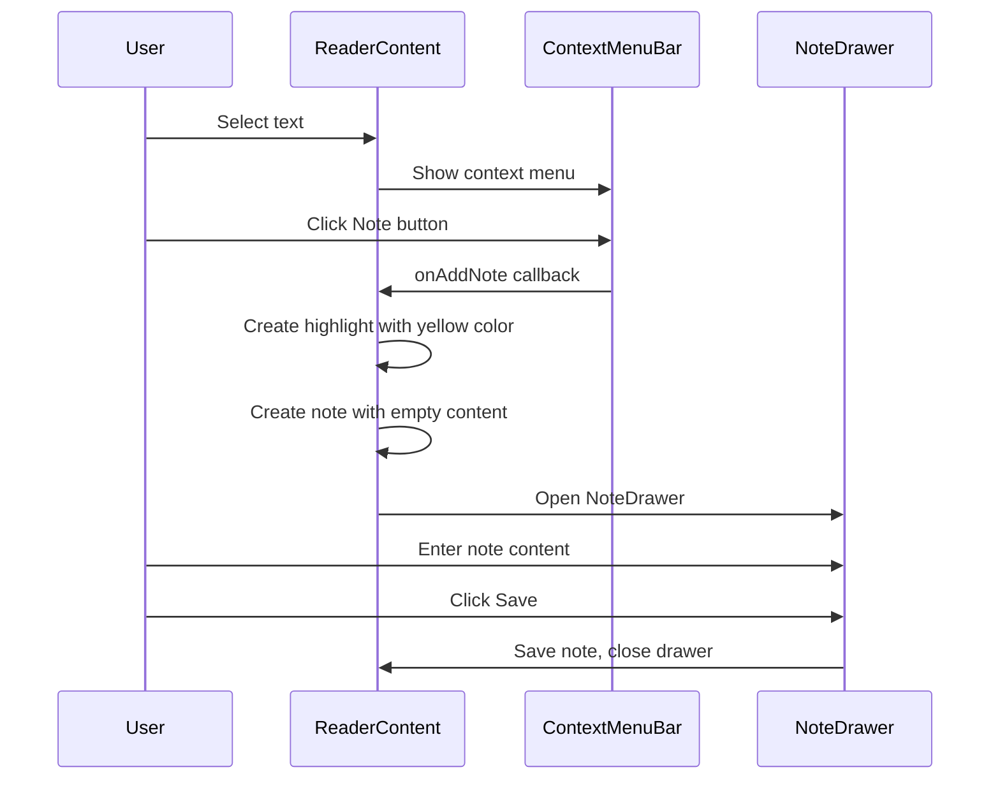
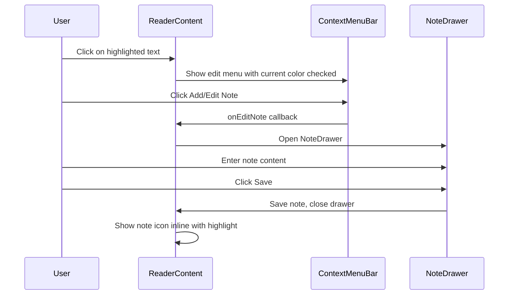
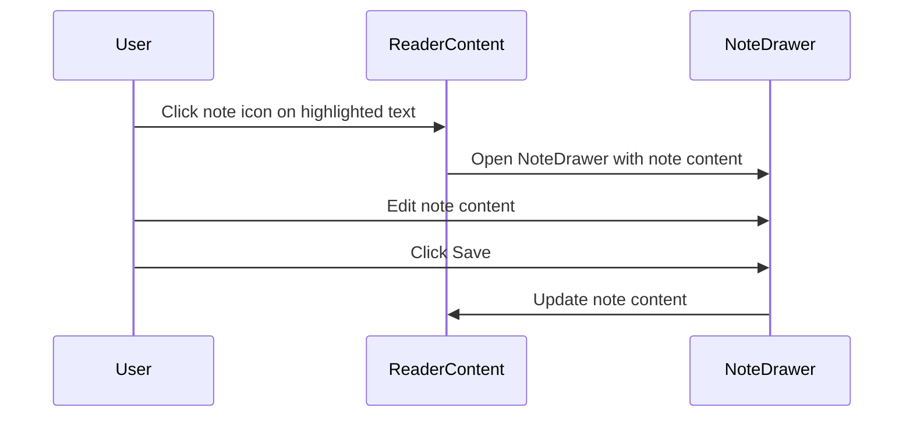

# Enhanced Highlight and Note-Taking System - Technical Design

## Executive Summary

This document outlines the technical design for enhancing the highlight and note-taking functionality in the Life-Study Reader app. The enhancements include:

1. **Note icons near highlighted text** - Display note indicators adjacent to the highlighted text rather than in the paragraph margin
2. **Add notes to any highlight color** - Allow attaching notes to existing highlights of any color
3. **Change highlight colors** - Enable users to modify the color of existing highlights

---

## 1. Current Implementation Analysis

### 1.1 Data Model

**Current types in [`lib/reading-data.ts`](lib/reading-data.ts:13):**

```typescript
export type HighlightColor = "yellow" | "green" | "blue" | "red"

export interface Highlight {
  paragraphIndex: number
  startOffset: number
  endOffset: number
  color: HighlightColor
  noteId?: string  // Optional reference to a Note
}

export interface Note {
  id: string
  highlightParagraphIndex: number
  quotedText: string
  content: string
  createdAt: string
}
```

### 1.2 Current Behavior

| Feature | Current Behavior |
|---------|------------------|
| Note icon position | Appears in the right margin of the paragraph, not near the highlighted text |
| Adding a note | Always creates a new yellow highlight with the note attached |
| Note on existing highlight | Not possible - must clear and re-create |
| Changing highlight color | Not supported - must clear and re-create |

### 1.3 Current Components

- [`ContextMenuBar`](components/reader/context-menu-bar.tsx:22) - Popup with color swatches, clear, and note buttons
- [`NoteDrawer`](components/reader/note-drawer.tsx:43) - Bottom sheet for editing notes
- [`StudyNotebook`](components/reader/study-notebook.tsx:128) - Dialog showing all highlights/notes
- [`ReaderContent`](components/reader/reader-content.tsx:93) - Renders text with highlights and note indicators

---

## 2. Proposed Data Model Changes

### 2.1 Enhanced Types

```typescript
// lib/reading-data.ts

// Add pink and purple to the color palette
export type HighlightColor = "yellow" | "green" | "blue" | "pink" | "purple" | "red"

// Add unique ID to Highlight for referencing
export interface Highlight {
  id: string                    // NEW: Unique identifier for the highlight
  paragraphIndex: number
  startOffset: number
  endOffset: number
  color: HighlightColor
  noteId?: string               // Reference to attached Note
  createdAt: string             // NEW: Creation timestamp
}

// Add reference back to highlight for easier lookups
export interface Note {
  id: string
  highlightId: string           // NEW: Reference to the highlight
  highlightParagraphIndex: number
  quotedText: string
  content: string
  createdAt: string
  updatedAt?: string            // NEW: Last modification timestamp
}
```

### 2.2 Rationale for Changes

| Change | Reason |
|--------|--------|
| Add `id` to Highlight | Enables direct referencing for color changes and note attachment |
| Add `createdAt` to Highlight | Useful for sorting and potential future features |
| Add `highlightId` to Note | Simplifies finding the associated highlight |
| Add `updatedAt` to Note | Track when notes were last modified |
| Add pink/purple colors | User requested additional color options |

---

## 3. UI/UX Design

### 3.1 Note Icon Near Highlighted Text

**Current Behavior:**
- Note icons appear in the right margin of paragraphs
- Multiple notes in same paragraph stack vertically

**Proposed Behavior:**
- Note icon appears inline, immediately after the highlighted text
- Icon is small and subtle, becoming more visible on hover
- Clicking the icon opens the note drawer

**Visual Design:**

```
...this is some highlighted text with a note 📝 and continues here...
                                  ↑
                           Small note icon inline
```

**Component Structure:**

```tsx
// Inside the <mark> element for highlighted text with a note
<mark className="highlight-yellow" data-highlight-id={highlight.id}>
  {sliceText}
  {active.noteId && (
    <button
      className="inline-note-icon"
      onClick={(e) => {
        e.stopPropagation()
        onOpenNote(active.noteId)
      }}
    >
      <StickyNote className="size-3.5 inline ml-0.5 text-primary/60 hover:text-primary" />
    </button>
  )}
</mark>
```

### 3.2 Enhanced Context Menu Bar

**Current Layout:**
```
[Yellow] [Green] [Blue] [Red] | [Clear] | [Note]
```

**Proposed Layout:**
```
[Yellow] [Green] [Blue] [Pink] [Purple] | [Edit Color] | [Clear] | [Add Note]
```

**New "Edit Color" Mode:**
When user clicks on an existing highlight:
- Show color picker to change the highlight color
- Preserve any attached note

### 3.3 Color Picker for Existing Highlights

**Scenario:** User taps/clicks on an existing highlight

**Behavior:**
1. Show context menu with color options
2. Current color is highlighted/checked
3. Selecting a new color updates the highlight
4. If highlight has a note, the note is preserved

**Visual Mockup:**

```
┌─────────────────────────────────────────┐
│  [✓Yellow] [Green] [Blue] [Pink] [Purple] │  <- Current color checked
│  ─────────────────────────────────────  │
│  [📝 Edit Note]  [🗑️ Clear]             │
└─────────────────────────────────────────┘
```

### 3.4 Note Drawer Enhancement

**Add color indicator when viewing a note:**

```tsx
// In NoteDrawer, show the highlight color
<div className="flex items-center gap-2 mb-3">
  <span className={cn("size-3 rounded-full", colorDots[highlight.color])} />
  <span className="text-xs text-muted-foreground">
    {l.colorNames[highlight.color]}
  </span>
</div>
```

---

## 4. Component Changes

### 4.1 [`lib/reading-data.ts`](lib/reading-data.ts)

**Changes Required:**
1. Update `HighlightColor` type to include pink and purple
2. Add `id` and `createdAt` fields to `Highlight` interface
3. Add `highlightId` and `updatedAt` fields to `Note` interface

```typescript
// Updated type definitions
export type HighlightColor = "yellow" | "green" | "blue" | "pink" | "purple" | "red"

export interface Highlight {
  id: string
  paragraphIndex: number
  startOffset: number
  endOffset: number
  color: HighlightColor
  noteId?: string
  createdAt: string
}

export interface Note {
  id: string
  highlightId: string
  highlightParagraphIndex: number
  quotedText: string
  content: string
  createdAt: string
  updatedAt?: string
}
```

### 4.2 [`components/reader/context-menu-bar.tsx`](components/reader/context-menu-bar.tsx)

**Changes Required:**
1. Add pink and purple color swatches
2. Add `editMode` prop to show edit-specific UI
3. Add `currentHighlight` prop for editing existing highlights
4. Add `onChangeColor` callback
5. Add `onEditNote` callback when highlight has a note

```typescript
interface ContextMenuBarProps {
  position: { top: number; left: number }
  // Existing selection mode
  onHighlight: (color: HighlightColor) => void
  onRemoveHighlight: () => void
  onAddNote: () => void
  // NEW: Edit mode for existing highlights
  editMode?: boolean
  currentHighlight?: {
    id: string
    color: HighlightColor
    hasNote: boolean
  }
  onChangeColor?: (highlightId: string, newColor: HighlightColor) => void
  onEditNote?: (highlightId: string) => void
  language: Language
}
```

### 4.3 [`components/reader/reader-content.tsx`](components/reader/reader-content.tsx)

**Changes Required:**
1. Update `renderParagraphWithHighlights` to include inline note icons
2. Add click handler for existing highlights to show edit menu
3. Update props to include new callbacks

```typescript
interface ReaderContentProps {
  // ... existing props
  // NEW: Additional callbacks
  onChangeHighlightColor: (highlightId: string, newColor: HighlightColor) => void
  onEditHighlightNote: (highlightId: string) => void
}
```

**Key Changes in [`renderParagraphWithHighlights`](components/reader/reader-content.tsx:34):**

```typescript
function renderParagraphWithHighlights(
  text: string, 
  paragraphIndex: number, 
  highlights: Highlight[],
  onOpenNote: (noteId: string) => void,
  onHighlightClick: (highlightId: string, e: React.MouseEvent) => void
) {
  // ... existing range logic ...

  // Updated mark rendering with inline note icon
  if (active) {
    parts.push(
      <mark
        key={`hl-${start}-${end}-${active.id}`}
        className={`highlight-${active.color}`}
        data-highlight-id={active.id}
        onClick={(e) => onHighlightClick(active.id, e)}
        style={{ cursor: 'pointer' }}
      >
        {sliceText}
        {active.noteId && (
          <button
            onClick={(e) => {
              e.stopPropagation()
              onOpenNote(active.noteId)
            }}
            className="inline-flex items-center ml-0.5 text-primary/50 hover:text-primary transition-colors"
            aria-label="View note"
          >
            <StickyNote className="size-3" />
          </button>
        )}
      </mark>
    )
  }
  // ...
}
```

### 4.4 [`components/reader/reader.tsx`](components/reader/reader.tsx)

**Changes Required:**
1. Add `handleChangeHighlightColor` handler
2. Add `handleAddNoteToHighlight` handler
3. Update `handleAddHighlight` to generate IDs
4. Update `handleAddNote` to work with existing highlights
5. Pass new props to child components

```typescript
// New handler for changing highlight color
const handleChangeHighlightColor = useCallback((highlightId: string, newColor: HighlightColor) => {
  setHighlights(prev => prev.map(h => 
    h.id === highlightId ? { ...h, color: newColor } : h
  ))
}, [])

// New handler for adding note to existing highlight
const handleAddNoteToHighlight = useCallback((highlightId: string) => {
  const highlight = highlights.find(h => h.id === highlightId)
  if (!highlight) return

  // If already has a note, open it
  if (highlight.noteId) {
    setActiveNoteId(highlight.noteId)
    setNoteDrawerOpen(true)
    return
  }

  // Create new note for this highlight
  const noteId = `note-${Date.now()}`
  const paraText = currentParagraphs[highlight.paragraphIndex] || ""
  const quotedText = paraText.slice(highlight.startOffset, highlight.endOffset)

  const newNote: Note = {
    id: noteId,
    highlightId: highlight.id,
    highlightParagraphIndex: highlight.paragraphIndex,
    quotedText,
    content: "",
    createdAt: new Date().toISOString(),
  }

  setNotes(prev => [...prev, newNote])
  setHighlights(prev => prev.map(h => 
    h.id === highlightId ? { ...h, noteId } : h
  ))
  setActiveNoteId(noteId)
  setNoteDrawerOpen(true)
}, [highlights, currentParagraphs])
```

### 4.5 [`components/reader/note-drawer.tsx`](components/reader/note-drawer.tsx)

**Changes Required:**
1. Accept highlight information to show color
2. Add ability to change highlight color from within the drawer

```typescript
interface NoteDrawerProps {
  open: boolean
  onOpenChange: (open: boolean) => void
  note: Note | null
  highlight?: Highlight  // NEW: Associated highlight info
  onSave: (noteId: string, content: string) => void
  onDelete: (noteId: string) => void
  onChangeColor?: (highlightId: string, newColor: HighlightColor) => void  // NEW
  language: Language
}
```

### 4.6 [`components/reader/study-notebook.tsx`](components/reader/study-notebook.tsx)

**Changes Required:**
1. Update color dots to include pink and purple
2. Update color names in labels

```typescript
const colorDots: Record<HighlightColor, string> = {
  yellow: "bg-yellow-400",
  green: "bg-emerald-400",
  blue: "bg-sky-400",
  pink: "bg-pink-400",      // NEW
  purple: "bg-purple-400",  // NEW
  red: "bg-rose-400",
}
```

### 4.7 [`app/globals.css`](app/globals.css)

**Changes Required:**
Add CSS styles for pink and purple highlights:

```css
/* Pink highlight */
.highlight-pink {
  background-color: oklch(0.85 0.12 330 / 0.45);
  color: oklch(0.22 0.02 330);
  border-radius: 2px;
  padding: 1px 0;
}
.dark .highlight-pink {
  background-color: oklch(0.50 0.12 330 / 0.4);
  color: oklch(0.18 0.02 330);
}

/* Purple highlight */
.highlight-purple {
  background-color: oklch(0.82 0.10 290 / 0.45);
  color: oklch(0.22 0.02 290);
  border-radius: 2px;
  padding: 1px 0;
}
.dark .highlight-purple {
  background-color: oklch(0.45 0.10 290 / 0.4);
  color: oklch(0.18 0.02 290);
}
```

---

## 5. User Flows

### 5.1 Creating a Highlight with a Note



### 5.2 Adding a Note to an Existing Highlight



### 5.3 Changing a Highlight Color

```mermaid
sequenceDiagram
    participant U as User
    participant RC as ReaderContent
    participant CM as ContextMenuBar

    U->>RC: Click on highlighted text
    RC->>CM: Show edit menu with current color checked
    U->>CM: Click different color
    CM->>RC: onChangeColor callback
    RC->>RC: Update highlight color
    Note: Attached note is preserved
```

### 5.4 Viewing/Editing a Note



---

## 6. Implementation Checklist

### Phase 1: Data Model Updates
- [ ] Update `HighlightColor` type with pink and purple
- [ ] Add `id` and `createdAt` fields to `Highlight`
- [ ] Add `highlightId` and `updatedAt` fields to `Note`
- [ ] Add CSS styles for pink and purple highlights

### Phase 2: Highlight ID Generation
- [ ] Update `handleAddHighlight` in Reader to generate unique IDs
- [ ] Update `handleAddNote` to use highlight IDs
- [ ] Ensure backward compatibility with existing stored data

### Phase 3: Context Menu Enhancement
- [ ] Update `ContextMenuBar` with pink and purple swatches
- [ ] Add edit mode support to `ContextMenuBar`
- [ ] Add color change and note edit callbacks

### Phase 4: Inline Note Icons
- [ ] Update `renderParagraphWithHighlights` to render inline note icons
- [ ] Add click handlers for opening notes from inline icons
- [ ] Remove old margin-based note indicators

### Phase 5: Highlight Click Handling
- [ ] Add click detection on existing highlights
- [ ] Show edit menu when highlight is clicked
- [ ] Implement color change functionality
- [ ] Implement add note to existing highlight

### Phase 6: Note Drawer Enhancement
- [ ] Add highlight color display in NoteDrawer
- [ ] Add ability to change highlight color from NoteDrawer

### Phase 7: Study Notebook Updates
- [ ] Update color dots and labels for pink/purple
- [ ] Ensure highlight cards work with new data structure

### Phase 8: Testing & Polish
- [ ] Test all user flows
- [ ] Test data migration/backward compatibility
- [ ] Test on mobile devices
- [ ] Accessibility review

---

## 7. Backward Compatibility

### 7.1 Data Migration Strategy

When loading stored highlights and notes, apply migration:

```typescript
function migrateHighlight(h: any): Highlight {
  return {
    id: h.id || `hl-${Date.now()}-${Math.random().toString(36).slice(2)}`,
    paragraphIndex: h.paragraphIndex,
    startOffset: h.startOffset,
    endOffset: h.endOffset,
    color: h.color || 'yellow',
    noteId: h.noteId,
    createdAt: h.createdAt || new Date().toISOString(),
  }
}

function migrateNote(n: any, highlights: Highlight[]): Note {
  // Try to find the associated highlight
  const highlight = highlights.find(h => 
    h.paragraphIndex === n.highlightParagraphIndex && h.noteId === n.id
  )
  
  return {
    id: n.id,
    highlightId: highlight?.id || '',
    highlightParagraphIndex: n.highlightParagraphIndex,
    quotedText: n.quotedText,
    content: n.content,
    createdAt: n.createdAt,
    updatedAt: n.updatedAt,
  }
}
```

### 7.2 Storage Considerations

- Existing highlights without IDs will be assigned IDs on load
- The `highlightId` field in Note will be populated by matching `paragraphIndex` and `noteId`
- No data loss will occur during migration

---

## 8. Future Enhancements

### Potential Future Features
1. **Highlight categories/tags** - Allow users to categorize highlights
2. **Export highlights** - Export to markdown, PDF, or note-taking apps
3. **Search within highlights** - Full-text search across all highlighted content
4. **Highlight sharing** - Share highlights with other users
5. **Cross-device sync** - Sync highlights and notes across devices

---

## 9. Summary

This design enhances the highlight and note-taking system with:

1. **Inline note icons** that appear directly adjacent to highlighted text
2. **Full color flexibility** with 6 color options including pink and purple
3. **Edit capabilities** to change highlight colors while preserving notes
4. **Seamless note attachment** to existing highlights of any color

The implementation requires updates to 7 files across the codebase, with careful attention to backward compatibility for existing user data.