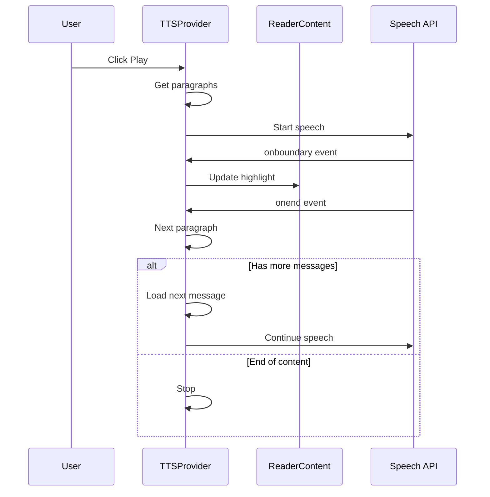

# Multilingual AI Text-to-Speech System - Technical Design

## Executive Summary

This document outlines the technical design for implementing a multilingual AI text-to-speech (TTS) feature in the Life-Study Reader app. The system will provide natural, human-like speech synthesis for Chinese (traditional/simplified) and English with seamless paragraph continuation across messages.

## Key Features

1. **Multilingual Support** - Natural speech for Chinese and English
2. **Voice Selection** - Choose voices per language
3. **Playback Controls** - Play, pause, stop, skip paragraph
4. **Speed Adjustment** - Adjustable playback rate
5. **Visual Highlighting** - Highlight currently spoken text
6. **Auto-Continue** - Automatically continue to next message
7. **Position Tracking** - Track speech position within paragraphs
8. **State Persistence** - Maintain state across re-renders

---

## 1. Architecture Overview

### 1.1 Component Structure

```
┌─────────────────────────────────────────────────────────────────┐
│                         Reader Component                         │
│  ┌─────────────────────────────────────────────────────────────┐ │
│  │                    TTSProvider Context                       │ │
│  │  ┌─────────────────────────────────────────────────────────┐ │ │
│  │  │                   useTTS Hook                            │ │ │
│  │  │  - Speech state management                               │ │ │
│  │  │  - Voice selection                                       │ │ │
│  │  │  - Playback controls                                     │ │ │
│  │  │  - Position tracking                                     │ │ │
│  │  └─────────────────────────────────────────────────────────┘ │ │
│  └─────────────────────────────────────────────────────────────┘ │
│                                                                  │
│  ┌──────────────────┐  ┌──────────────────┐  ┌────────────────┐  │
│  │   ReaderHeader   │  │   ReaderContent  │  │  ReaderFooter  │  │
│  │  - TTS Button    │  │  - Highlighting  │  │ - TTS Controls │  │
│  └──────────────────┘  └──────────────────┘  └────────────────┘  │
└─────────────────────────────────────────────────────────────────┘
```

### 1.2 Data Flow



---

## 2. Data Model

### 2.1 TTS State Interface

```typescript
// lib/tts-types.ts

export type TTSStatus = 'idle' | 'playing' | 'paused' | 'loading'

export interface TTSVoice {
  id: string
  name: string
  lang: string  // 'zh-TW', 'zh-CN', 'en-US', etc.
  nativeLang: 'zh' | 'en'
  quality: 'standard' | 'enhanced' | 'neural'
  isDefault: boolean
}

export interface TTSSettings {
  voiceId: string
  rate: number        // 0.5 - 2.0
  pitch: number       // 0.5 - 2.0
  volume: number      // 0.0 - 1.0
  autoContinue: boolean  // Auto-continue to next message
}

export interface TTSSpeechPosition {
  messageIndex: number
  paragraphIndex: number
  charIndex: number
  charLength: number
}

export interface TTSState {
  status: TTSStatus
  position: TTSSpeechPosition | null
  settings: TTSSettings
  availableVoices: TTSVoice[]
}
```

### 2.2 Voice Configuration

```typescript
// Recommended voices for each language
const recommendedVoices: Record<string, string[]> = {
  'zh-TW': [
    'Google 臺灣華語',
    'Microsoft HsiaoChen Online (Natural)',
    'zh-TW',
  ],
  'zh-CN': [
    'Google 普通话',
    'Microsoft Xiaoxiao Online (Natural)',
    'zh-CN',
  ],
  'en-US': [
    'Google US English',
    'Microsoft Jenny Online (Natural)',
    'en-US',
  ],
}
```

---

## 3. Core Hook: useTTS

### 3.1 Hook Interface

```typescript
interface UseTTSOptions {
  language: Language
  paragraphs: string[]
  messageIndex: number
  totalMessages: number
  onMessageChange?: (index: number) => void
  onPositionChange?: (position: TTSSpeechPosition) => void
}

interface UseTTSReturn {
  // State
  status: TTSStatus
  position: TTSSpeechPosition | null
  settings: TTSSettings
  availableVoices: TTSVoice[]
  currentVoice: TTSVoice | null
  
  // Actions
  play: () => void
  pause: () => void
  stop: () => void
  nextParagraph: () => void
  prevParagraph: () => void
  setRate: (rate: number) => void
  setVoice: (voiceId: string) => void
  setAutoContinue: (enabled: boolean) => void
  speakFromPosition: (messageIndex: number, paragraphIndex: number) => void
}
```

### 3.2 Implementation Strategy

```typescript
// hooks/use-tts.ts

export function useTTS(options: UseTTSOptions): UseTTSReturn {
  const {
    language,
    paragraphs,
    messageIndex,
    totalMessages,
    onMessageChange,
    onPositionChange,
  } = options

  // State refs for speech synthesis
  const synthRef = useRef<SpeechSynthesis | null>(null)
  const utteranceRef = useRef<SpeechSynthesisUtterance | null>(null)
  
  // Persisted state
  const [status, setStatus] = useState<TTSStatus>('idle')
  const [position, setPosition] = useState<TTSSpeechPosition | null>(null)
  const [settings, setSettings] = useState<TTSSettings>(() => loadTTSSettings())
  const [availableVoices, setAvailableVoices] = useState<TTSVoice[]>([])

  // Load voices on mount
  useEffect(() => {
    if (typeof window === 'undefined') return
    
    const synth = window.speechSynthesis
    synthRef.current = synth

    const loadVoices = () => {
      const voices = synth.getVoices()
      const mapped = mapVoicesToTTSVoice(voices)
      setAvailableVoices(mapped)
    }

    loadVoices()
    synth.addEventListener('voiceschanged', loadVoices)
    
    return () => {
      synth.removeEventListener('voiceschanged', loadVoices)
      synth.cancel()
    }
  }, [])

  // Language change - auto-select best voice
  useEffect(() => {
    const bestVoice = selectBestVoice(availableVoices, language)
    if (bestVoice && bestVoice.id !== settings.voiceId) {
      setSettings(prev => ({ ...prev, voiceId: bestVoice.id }))
    }
  }, [language, availableVoices])

  // ... rest of implementation
}
```

---

## 4. Visual Highlighting

### 4.1 Highlighting Strategy

The current highlight system uses `mark` elements. For TTS highlighting, we'll use a distinct style:

```css
/* TTS highlight - different from user highlights */
.tts-highlight {
  background-color: oklch(0.75 0.15 180 / 0.3);
  color: inherit;
  border-radius: 2px;
  padding: 1px 0;
  transition: background-color 0.1s ease;
}

.dark .tts-highlight {
  background-color: oklch(0.50 0.12 180 / 0.35);
}

/* Animated pulse for current word */
.tts-highlight-current {
  animation: tts-pulse 1s ease-in-out infinite;
}

@keyframes tts-pulse {
  0%, 100% { background-color: oklch(0.75 0.15 180 / 0.3); }
  50% { background-color: oklch(0.75 0.15 180 / 0.5); }
}
```

### 4.2 Paragraph Rendering Update

```typescript
// In reader-content.tsx

function renderParagraphWithTTS(
  text: string,
  paragraphIndex: number,
  ttsPosition: TTSSpeechPosition | null,
  ttsStatus: TTSStatus,
  highlights: Highlight[],
  onOpenNote: (noteId: string) => void,
  onHighlightClick: (highlightId: string, e: React.MouseEvent) => void
) {
  // Check if TTS is active on this paragraph
  const isTTSHighlighted = ttsStatus !== 'idle' && 
    ttsPosition?.paragraphIndex === paragraphIndex

  // If TTS is highlighting a portion of this paragraph
  if (isTTSHighlighted && ttsPosition) {
    const { charIndex, charLength } = ttsPosition
    const before = text.slice(0, charIndex)
    const highlighted = text.slice(charIndex, charIndex + charLength)
    const after = text.slice(charIndex + charLength)

    // Render with TTS highlight (in addition to user highlights)
    return (
      <>
        {before}
        <span className="tts-highlight tts-highlight-current">
          {highlighted}
        </span>
        {after}
      </>
    )
  }

  // Fall back to normal highlight rendering
  return renderParagraphWithHighlights(text, paragraphIndex, highlights, onOpenNote, onHighlightClick)
}
```

---

## 5. UI Components

### 5.1 TTS Controls Bar

A new control bar positioned above the footer when TTS is active:

```typescript
// components/reader/tts-controls.tsx

interface TTSControlsProps {
  status: TTSStatus
  position: TTSSpeechPosition | null
  settings: TTSSettings
  onPlay: () => void
  onPause: () => void
  onStop: () => void
  onNext: () => void
  onPrev: () => void
  onRateChange: (rate: number) => void
  onVoiceChange: (voiceId: string) => void
  onAutoContinueChange: (enabled: boolean) => void
  language: Language
}

function TTSControls({ ... }: TTSControlsProps) {
  return (
    <div className="fixed bottom-12 left-0 right-0 z-30 bg-background/95 backdrop-blur-md border-t border-border">
      {/* Progress indicator */}
      <div className="h-0.5 bg-secondary">
        <div className="h-full bg-primary/70 transition-all" 
             style={{ width: `${progress}%` }} />
      </div>
      
      {/* Controls */}
      <div className="flex items-center justify-between h-12 px-4 max-w-2xl mx-auto">
        {/* Left: Play/Pause/Stop */}
        <div className="flex items-center gap-2">
          <Button size="icon" variant="ghost" onClick={onStop}>
            <Square className="size-4" />
          </Button>
          <Button size="icon" onClick={status === 'playing' ? onPause : onPlay}>
            {status === 'playing' ? <Pause className="size-5" /> : <Play className="size-5" />}
          </Button>
        </div>

        {/* Center: Position info */}
        <div className="text-xs text-muted-foreground">
          {currentParagraph} / {totalParagraphs}
        </div>

        {/* Right: Speed & Settings */}
        <div className="flex items-center gap-2">
          <Select value={String(settings.rate)} onValueChange={onRateChange}>
            {/* Speed options */}
          </Select>
          <Button size="icon" variant="ghost" onClick={openSettings}>
            <Settings className="size-4" />
          </Button>
        </div>
      </div>
    </div>
  )
}
```

### 5.2 TTS Settings Panel

```typescript
// components/reader/tts-settings-panel.tsx

interface TTSSettingsPanelProps {
  open: boolean
  onOpenChange: (open: boolean) => void
  settings: TTSSettings
  availableVoices: TTSVoice[]
  currentLanguage: Language
  onVoiceChange: (voiceId: string) => void
  onRateChange: (rate: number) => void
  onAutoContinueChange: (enabled: boolean) => void
}

function TTSSettingsPanel({ ... }: TTSSettingsPanelProps) {
  // Filter voices by current language
  const filteredVoices = availableVoices.filter(
    voice => voice.nativeLang === (currentLanguage === 'english' ? 'en' : 'zh')
  )

  return (
    <Sheet open={open} onOpenChange={onOpenChange}>
      <SheetContent>
        {/* Voice selection */}
        <div className="space-y-2">
          <Label>Voice</Label>
          <RadioGroup value={settings.voiceId} onValueChange={onVoiceChange}>
            {filteredVoices.map(voice => (
              <div key={voice.id} className="flex items-center space-x-2">
                <RadioGroupItem value={voice.id} id={voice.id} />
                <Label htmlFor={voice.id}>{voice.name}</Label>
              </div>
            ))}
          </RadioGroup>
        </div>

        {/* Speed slider */}
        <div className="space-y-2">
          <Label>Speed: {settings.rate}x</Label>
          <Slider 
            value={[settings.rate]} 
            min={0.5} 
            max={2} 
            step={0.1}
            onValueChange={([rate]) => onRateChange(rate)}
          />
        </div>

        {/* Auto-continue toggle */}
        <div className="flex items-center justify-between">
          <Label>Auto-continue to next message</Label>
          <Switch 
            checked={settings.autoContinue} 
            onCheckedChange={onAutoContinueChange} 
          />
        </div>
      </SheetContent>
    </Sheet>
  )
}
```

### 5.3 Header TTS Button

Add a speaker button to the header:

```typescript
// In reader-header.tsx

<Button
  variant="ghost"
  size="icon"
  onClick={onTTSClick}
  className={cn(
    "text-foreground",
    isTTSSpeaking && "text-primary"
  )}
  aria-label="Text to speech"
>
  {isTTSSpeaking ? <Volume2 className="size-5" /> : <Volume1 className="size-5" />}
</Button>
```

---

## 6. Integration Points

### 6.1 Reader.tsx Integration

```typescript
// In reader.tsx

// Add TTS hook
const {
  status: ttsStatus,
  position: ttsPosition,
  settings: ttsSettings,
  availableVoices: ttsVoices,
  currentVoice: ttsCurrentVoice,
  play: ttsPlay,
  pause: ttsPause,
  stop: ttsStop,
  nextParagraph: ttsNext,
  prevParagraph: ttsPrev,
  setRate: ttsSetRate,
  setVoice: ttsSetVoice,
  setAutoContinue: ttsSetAutoContinue,
  speakFromPosition: ttsSpeakFrom,
} = useTTS({
  language,
  paragraphs: currentParagraphs,
  messageIndex: safeIndex,
  totalMessages,
  onMessageChange: (index) => {
    setCurrentMessageIndex(index)
    persistMessageIndex(index)
  },
  onPositionChange: (pos) => {
    // Scroll to paragraph if needed
    scrollToParagraph(pos.paragraphIndex)
  },
})

// TTS settings panel state
const [ttsSettingsOpen, setTTSSettingsOpen] = useState(false)

// Update ReaderContent props
<ReaderContent
  // ... existing props
  ttsStatus={ttsStatus}
  ttsPosition={ttsPosition}
/>

// Add TTS Controls
{ttsStatus !== 'idle' && (
  <TTSControls
    status={ttsStatus}
    position={ttsPosition}
    settings={ttsSettings}
    onPlay={ttsPlay}
    onPause={ttsPause}
    onStop={ttsStop}
    onNext={ttsNext}
    onPrev={ttsPrev}
    onRateChange={ttsSetRate}
    onVoiceChange={ttsSetVoice}
    onAutoContinueChange={ttsSetAutoContinue}
    language={language}
  />
)}

// Add TTS Settings Panel
<TTSSettingsPanel
  open={ttsSettingsOpen}
  onOpenChange={setTTSSettingsOpen}
  settings={ttsSettings}
  availableVoices={ttsVoices}
  currentLanguage={language}
  onVoiceChange={ttsSetVoice}
  onRateChange={ttsSetRate}
  onAutoContinueChange={ttsSetAutoContinue}
/>
```

### 6.2 Study Notebook Integration

Allow playing notes from the study notebook:

```typescript
// In study-notebook.tsx

// Add TTS context
const { speakParagraph } = useTTS()

// Add speaker button to each highlight card
<Button
  variant="ghost"
  size="icon"
  onClick={() => speakParagraph(highlight.paragraphIndex)}
>
  <Volume2 className="size-3" />
</Button>
```

---

## 7. State Persistence

### 7.1 Settings Storage

```typescript
// lib/tts-storage.ts

const TTS_SETTINGS_KEY = 'life-study:tts-settings'

export function loadTTSSettings(): TTSSettings {
  if (typeof window === 'undefined') {
    return {
      voiceId: '',
      rate: 1.0,
      pitch: 1.0,
      volume: 1.0,
      autoContinue: true,
    }
  }

  try {
    const saved = localStorage.getItem(TTS_SETTINGS_KEY)
    if (saved) {
      return JSON.parse(saved)
    }
  } catch {}

  return {
    voiceId: '',
    rate: 1.0,
    pitch: 1.0,
    volume: 1.0,
    autoContinue: true,
  }
}

export function saveTTSSettings(settings: TTSSettings): void {
  if (typeof window === 'undefined') return
  
  try {
    localStorage.setItem(TTS_SETTINGS_KEY, JSON.stringify(settings))
  } catch {}
}
```

### 7.2 Position Persistence

Position is tracked in the TTS hook and can be persisted for resuming:

```typescript
// Save position when pausing or stopping
useEffect(() => {
  if (status === 'paused' && position) {
    sessionStorage.setItem('life-study:tts-position', JSON.stringify(position))
  }
}, [status, position])

// Restore position when playing
const play = useCallback(() => {
  const savedPosition = sessionStorage.getItem('life-study:tts-position')
  if (savedPosition && !position) {
    const parsed = JSON.parse(savedPosition)
    speakFromPosition(parsed.messageIndex, parsed.paragraphIndex)
  } else {
    // Continue from current position or start from beginning
    speakFromCurrentPosition()
  }
}, [position])
```

---

## 8. Implementation Checklist

### Phase 1: Core Infrastructure
- [ ] Create `lib/tts-types.ts` with type definitions
- [ ] Create `lib/tts-storage.ts` for settings persistence
- [ ] Create `hooks/use-tts.ts` hook

### Phase 2: UI Components
- [ ] Create `components/reader/tts-controls.tsx`
- [ ] Create `components/reader/tts-settings-panel.tsx`
- [ ] Update `components/reader/reader-header.tsx` with TTS button
- [ ] Add TTS CSS styles to `app/globals.css`

### Phase 3: Integration
- [ ] Update `components/reader/reader.tsx` with TTS integration
- [ ] Update `components/reader/reader-content.tsx` with TTS highlighting
- [ ] Update `components/reader/reader-footer.tsx` to account for TTS bar

### Phase 4: Study Notebook Integration
- [ ] Add TTS controls to `components/reader/study-notebook.tsx`
- [ ] Allow playing highlights from notebook

### Phase 5: Testing & Polish
- [ ] Test on multiple browsers
- [ ] Test on mobile devices
- [ ] Test voice switching
- [ ] Test auto-continue across messages
- [ ] Performance optimization

---

## 9. Browser Compatibility Notes

### Web Speech API Support

| Browser | Support | Notes |
|---------|---------|-------|
| Chrome | Full | Best voice selection, includes Google Neural voices |
| Safari | Full | Uses Apple voices |
| Firefox | Partial | Limited voice options on some platforms |
| Edge | Full | Uses Microsoft voices, including Natural voices |
| Mobile Chrome | Partial | Works but voices may be limited |
| Mobile Safari | Partial | Works with iOS voices |

### Fallback Strategy

If Web Speech API is not available:
1. Show a message that TTS is not supported
2. Optionally, provide a link to a browser that supports it

```typescript
function checkTTSSupport(): boolean {
  return typeof window !== 'undefined' && 'speechSynthesis' in window
}
```

---

## 10. Future Enhancements

1. **Cloud TTS Integration** - Use cloud services like Google Cloud TTS or Azure Speech for higher quality voices
2. **Offline Support** - Download and cache preferred voices
3. **Voice Preview** - Allow users to preview voices before selecting
4. **Paragraph Skip** - Skip code blocks, headings, or specific content types
5. **Sleep Timer** - Auto-stop after a set duration
6. **Background Playback** - Continue playing when app is in background (PWA)

---

## 11. Summary

This design provides a comprehensive TTS system that:
- Supports Chinese and English with natural, human-like voices
- Integrates seamlessly with existing highlight and note-taking features
- Persists state across component re-renders
- Auto-continues across messages by default
- Provides visual feedback for currently spoken text
- Offers full playback controls and customization options