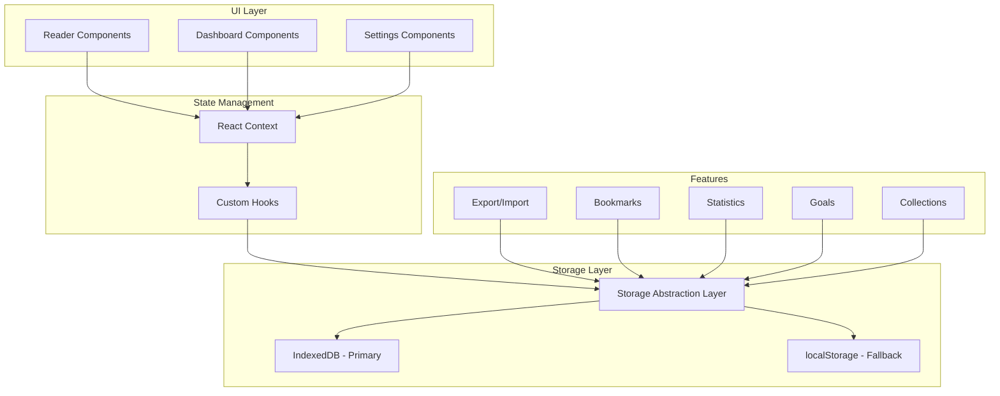
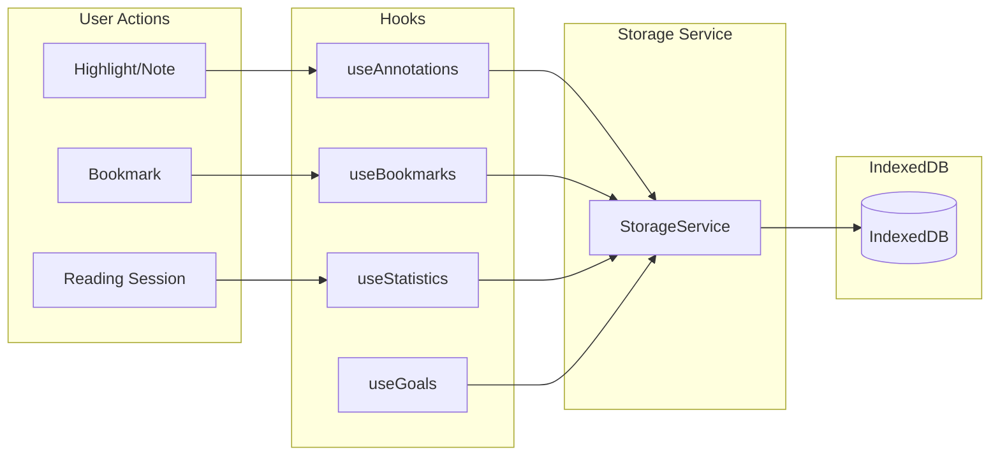
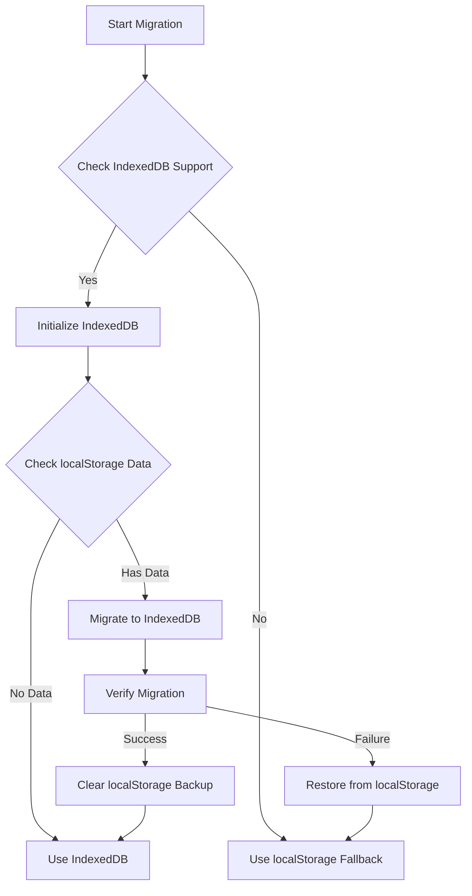

# Personal Reader Enhancement Plan

## Executive Summary

This document outlines a comprehensive implementation plan for enhancing the life-study-reader into a complete personal reader web application. The plan covers five major feature areas organized by priority, with detailed technical specifications for each.

---

## Current State Analysis

### Existing Features

| Feature | Implementation | Storage |
|---------|---------------|---------|
| Highlights & Notes | 6 colors, note attachments, study notebook | localStorage |
| Reading Progress | Scroll position, percentage tracking | localStorage |
| TTS/Audio | Edge TTS + Browser fallback, 50+ voices | localStorage |
| Bilingual Support | Chinese/English, traditional/simplified conversion | localStorage |
| Settings | Theme, fonts, TTS preferences | localStorage |

### Current Storage Pattern

```
life-study-reader:${bookId}:${messageIndex}:${language}
life-study:reader-settings
life-study:tts-settings
life-study-reader:${bookId}:messageIndex
```

### Current Data Models

From [`lib/reading-data.ts`](lib/reading-data.ts:17):

```typescript
interface Highlight {
  id: string
  paragraphIndex: number
  startOffset: number
  endOffset: number
  color: HighlightColor
  noteId?: string
  createdAt: string
}

interface Note {
  id: string
  highlightId: string
  highlightParagraphIndex: number
  quotedText: string
  content: string
  createdAt: string
  updatedAt?: string
}
```

---

## Architecture Overview

### System Architecture Diagram



### Data Flow Architecture



---

## Priority 1: Data Safety

### Feature 1: Export/Import System

#### 1.1 Data Model

```typescript
// types/export-import.ts

interface ExportData {
  version: string                    // Schema version for migration
  exportedAt: string                 // ISO timestamp
  appVersion: string                 // App version for compatibility
  
  // User content
  annotations: {
    highlights: Highlight[]
    notes: Note[]
  }
  
  bookmarks: Bookmark[]
  collections: Collection[]
  
  // Reading data
  progress: ReadingProgress[]
  statistics: ReadingStatistics
  
  // User preferences
  settings: {
    reader: ReaderSettings
    tts: TTSSettings
    language: LanguagePreference
  }
}

interface ImportResult {
  success: boolean
  imported: {
    highlights: number
    notes: number
    bookmarks: number
    collections: number
    progressRecords: number
  }
  errors: string[]
  warnings: string[]
}
```

#### 1.2 Storage Strategy

| Data Type | Current | Proposed |
|-----------|---------|----------|
| Highlights/Notes | localStorage | IndexedDB |
| Bookmarks | N/A | IndexedDB |
| Progress | localStorage | IndexedDB |
| Settings | localStorage | localStorage + IndexedDB backup |

**Rationale for IndexedDB Migration:**
- Storage capacity: localStorage ~5-10MB vs IndexedDB ~250MB+
- Performance: Better for large datasets with indexed queries
- Structured data: Native support for complex objects
- Transaction support: ACID guarantees for data integrity

#### 1.3 Component Architecture

```
lib/
├── storage/
│   ├── storage-service.ts       # Abstraction layer
│   ├── indexeddb-service.ts     # IndexedDB operations
│   ├── localstorage-service.ts  # localStorage fallback
│   └── migration.ts             # Data migration utilities
├── export/
│   ├── exporter.ts              # Export logic
│   ├── importer.ts              # Import logic
│   └── validator.ts             # Schema validation
└── backup/
    ├── auto-backup.ts           # Automatic backup logic
    └── reminder.ts              # Backup reminder system

components/
├── settings/
│   ├── export-panel.tsx         # Export UI
│   ├── import-panel.tsx         # Import UI
│   └── backup-reminder.tsx      # Backup notification
└── shared/
    └── storage-indicator.tsx    # Storage usage display
```

#### 1.4 UI/UX Design

**Export Panel:**
- One-click full export
- Selective export options
- Export format: JSON with optional encryption
- Include/exclude options per data type

**Import Panel:**
- Drag-and-drop file upload
- Preview before importing
- Merge or replace options
- Conflict resolution UI

**Auto-Backup Reminder:**
- Check last backup date
- Show reminder after 7+ days
- Configurable reminder frequency
- Quick backup button

#### 1.5 Implementation Steps

1. **Create storage abstraction layer**
   - Define `StorageService` interface
   - Implement `IndexedDBService` class
   - Implement `LocalStorageService` class
   - Create factory for automatic selection

2. **Implement IndexedDB schema**
   - Database name: `life-study-reader-db`
   - Object stores: `highlights`, `notes`, `bookmarks`, `progress`, `collections`, `settings`
   - Define indexes for efficient queries

3. **Create migration utility**
   - Detect localStorage data
   - Migrate to IndexedDB
   - Preserve localStorage as backup
   - Handle migration errors gracefully

4. **Build export functionality**
   - Aggregate data from all stores
   - Generate JSON with metadata
   - Create downloadable file
   - Add optional encryption

5. **Build import functionality**
   - Parse uploaded file
   - Validate schema version
   - Apply migrations if needed
   - Merge or replace existing data

6. **Implement backup reminder**
   - Track last backup timestamp
   - Show notification on app load
   - Add settings toggle

#### 1.6 File Structure

```
lib/storage/
├── index.ts
├── types.ts
├── storage-service.ts
├── indexeddb-service.ts
├── localstorage-service.ts
└── migration.ts

lib/export/
├── index.ts
├── types.ts
├── exporter.ts
├── importer.ts
└── validator.ts

hooks/
├── use-storage.ts
├── use-export.ts
└── use-import.ts
```

---

## Priority 2: Enhanced Reading Experience

### Feature 2: Bookmarks System

#### 2.1 Data Model

```typescript
// types/bookmark.ts

interface Bookmark {
  id: string
  bookId: string
  messageIndex: number
  paragraphIndex?: number          // Optional specific paragraph
  label: string                    // User-defined label
  color?: BookmarkColor            // Optional color coding
  category?: string                // User-defined category
  note?: string                    // Optional note
  createdAt: string
  updatedAt?: string
}

type BookmarkColor = 'default' | 'red' | 'orange' | 'green' | 'blue' | 'purple'

interface BookmarkCategory {
  id: string
  name: string
  color: BookmarkColor
  order: number
}
```

#### 2.2 Storage Strategy

| Storage | Use Case |
|---------|----------|
| IndexedDB | Primary storage for bookmarks |
| In-memory cache | Quick access during session |

#### 2.3 Component Architecture

```
components/
├── bookmarks/
│   ├── bookmark-button.tsx       # Add bookmark FAB
│   ├── bookmark-dialog.tsx       # Create/edit bookmark
│   ├── bookmark-list.tsx         # List all bookmarks
│   ├── bookmark-item.tsx         # Single bookmark card
│   ├── bookmark-categories.tsx   # Category management
│   └── bookmark-navigator.tsx    # Quick navigation
```

#### 2.4 UI/UX Design

**Add Bookmark:**
- Floating action button or toolbar icon
- Quick add with default label
- Long-press for detailed options

**Bookmark List:**
- Sortable by date, book, category
- Filter by category
- Search by label/note
- Swipe to delete on mobile

**Navigation:**
- Jump directly to bookmarked location
- Show context preview
- Previous/Next bookmark navigation

#### 2.5 Implementation Steps

1. Define bookmark types and interfaces
2. Create `useBookmarks` hook with CRUD operations
3. Implement IndexedDB bookmark store
4. Build bookmark button component
5. Create bookmark dialog for add/edit
6. Build bookmark list with filtering
7. Implement quick navigation
8. Add category management UI

---

### Feature 3: Reading Statistics

#### 3.1 Data Model

```typescript
// types/statistics.ts

interface ReadingSession {
  id: string
  bookId: string
  messageIndex: number
  startTime: string
  endTime: string
  duration: number                  // Seconds
  paragraphsRead: number
  wordsRead: number                 // Estimated
  language: Language
}

interface DailyStatistics {
  date: string                      // YYYY-MM-DD
  totalDuration: number             // Seconds
  sessionsCount: number
  messagesCompleted: number
  paragraphsRead: number
  wordsRead: number
  books: string[]                   // Book IDs read
}

interface ReadingStreak {
  current: number                   // Current streak days
  longest: number                   // Longest streak
  lastReadDate: string             // Last reading date
}

interface ReadingStatistics {
  total: {
    duration: number                // All-time total seconds
    sessions: number
    messages: number
    words: number
  }
  streak: ReadingStreak
  byBook: Record<string, {
    duration: number
    sessions: number
    messages: number
  }>
  byMonth: Record<string, {         // Key: YYYY-MM
    duration: number
    sessions: number
    messages: number
  }>
}
```

#### 3.2 Storage Strategy

| Data | Storage | Retention |
|------|---------|-----------|
| Sessions | IndexedDB | 90 days detailed, then aggregated |
| Daily Stats | IndexedDB | 1 year |
| Aggregated Stats | IndexedDB | Permanent |

#### 3.3 Component Architecture

```
lib/
├── statistics/
│   ├── tracker.ts                 # Session tracking logic
│   ├── calculator.ts              # Statistics calculation
│   └── aggregator.ts              # Data aggregation

components/
├── statistics/
│   ├── statistics-dashboard.tsx   # Main dashboard
│   ├── streak-card.tsx            # Streak display
│   ├── time-chart.tsx             # Reading time chart
│   ├── book-stats.tsx             # Per-book statistics
│   └── session-list.tsx           # Recent sessions
```

#### 3.4 UI/UX Design

**Dashboard Overview:**
- Current streak prominently displayed
- Weekly/Monthly reading time chart
- Books read progress
- Recent activity timeline

**Statistics Cards:**
- Total reading time
- Messages completed
- Average session length
- Reading consistency score

**Charts:**
- Daily/Weekly/Monthly toggle
- Bar chart for time distribution
- Line chart for trends

#### 3.5 Implementation Steps

1. Define statistics data models
2. Create session tracking utility
3. Implement `useStatistics` hook
4. Build streak calculation logic
5. Create dashboard layout
6. Implement time chart component
7. Add streak notification system
8. Build statistics export feature

---

### Feature 4: Reading Goals

#### 4.1 Data Model

```typescript
// types/goals.ts

interface ReadingGoal {
  id: string
  type: GoalType
  target: number
  period: GoalPeriod
  isActive: boolean
  createdAt: string
}

type GoalType = 'time' | 'messages' | 'streak'
type GoalPeriod = 'daily' | 'weekly' | 'monthly'

interface GoalProgress {
  goalId: string
  period: string                   // YYYY-MM-DD or YYYY-WW or YYYY-MM
  current: number
  target: number
  completed: boolean
  completedAt?: string
}

interface GoalNotification {
  type: 'milestone' | 'completed' | 'streak-risk'
  milestone?: number               // 25%, 50%, 75%, 100%
  message: string
}
```

#### 4.2 Storage Strategy

| Data | Storage |
|------|---------|
| Goals | IndexedDB |
| Progress | IndexedDB |
| Notifications | In-memory + optional persist |

#### 4.3 Component Architecture

```
components/
├── goals/
│   ├── goal-settings.tsx          # Create/edit goals
│   ├── goal-progress.tsx          # Progress display
│   ├── goal-card.tsx              # Individual goal card
│   ├── goal-celebration.tsx       # Achievement animation
│   └── goal-reminder.tsx          # Daily reminder notification
```

#### 4.4 UI/UX Design

**Goal Types:**
- Daily reading time: "Read 30 minutes daily"
- Weekly messages: "Complete 5 messages weekly"
- Monthly streak: "Read every day this month"

**Progress Display:**
- Circular progress indicator
- Percentage completion
- Days remaining counter
- Visual progress bar

**Celebrations:**
- Animated celebration on goal completion
- Streak milestone badges
- Achievement sharing option

#### 4.5 Implementation Steps

1. Define goal types and interfaces
2. Create `useGoals` hook
3. Implement goal tracking logic
4. Build goal creation UI
5. Create progress visualization
6. Implement milestone notifications
7. Add celebration animations
8. Build reminder system

---

## Priority 3: Organization

### Feature 5: Custom Collections

#### 5.1 Data Model

```typescript
// types/collection.ts

interface Collection {
  id: string
  name: string
  description?: string
  color: CollectionColor
  icon?: string                    // Emoji or icon name
  order: number
  createdAt: string
  updatedAt?: string
}

interface CollectionItem {
  id: string
  collectionId: string
  bookId: string
  messageIndex: number
  paragraphIndex?: number          // Optional specific paragraph
  note?: string                    // User note for this item
  addedAt: string
}

type CollectionColor = 'gray' | 'red' | 'orange' | 'yellow' | 'green' | 'blue' | 'purple' | 'pink'
```

#### 5.2 Storage Strategy

| Data | Storage |
|------|---------|
| Collections | IndexedDB |
| Collection Items | IndexedDB |

#### 5.3 Component Architecture

```
components/
├── collections/
│   ├── collection-manager.tsx     # Manage all collections
│   ├── collection-card.tsx        # Collection preview
│   ├── collection-detail.tsx      # Collection content view
│   ├── add-to-collection.tsx      # Add item to collection
│   └── collection-picker.tsx      # Quick picker modal
```

#### 5.4 UI/UX Design

**Collection Management:**
- Create/Edit/Delete collections
- Custom colors and icons
- Drag to reorder

**Adding to Collection:**
- Context menu option
- Quick add button
- Multi-select for batch add

**Collection View:**
- List items with thumbnails
- Sort by date added, book, custom
- Quick navigation to item

#### 5.5 Implementation Steps

1. Define collection types and interfaces
2. Create `useCollections` hook
3. Implement IndexedDB collection stores
4. Build collection manager UI
5. Create add-to-collection flow
6. Implement collection detail view
7. Add collection sharing/export
8. Build collection search feature

---

## Shared Utilities

### Storage Service Interface

```typescript
// lib/storage/types.ts

interface StorageService {
  // Annotations
  getHighlights(bookId: string, messageIndex: number, language: Language): Promise<Highlight[]>
  saveHighlights(bookId: string, messageIndex: number, language: Language, highlights: Highlight[]): Promise<void>
  getAllHighlights(): Promise<Highlight[]>
  
  getNotes(bookId: string, messageIndex: number, language: Language): Promise<Note[]>
  saveNotes(bookId: string, messageIndex: number, language: Language, notes: Note[]): Promise<void>
  getAllNotes(): Promise<Note[]>
  
  // Bookmarks
  getBookmarks(): Promise<Bookmark[]>
  saveBookmark(bookmark: Bookmark): Promise<void>
  deleteBookmark(id: string): Promise<void>
  
  // Progress
  getProgress(bookId: string, messageIndex: number, language: Language): Promise<ReadingProgress | null>
  saveProgress(progress: ReadingProgress): Promise<void>
  getAllProgress(): Promise<ReadingProgress[]>
  
  // Collections
  getCollections(): Promise<Collection[]>
  saveCollection(collection: Collection): Promise<void>
  deleteCollection(id: string): Promise<void>
  getCollectionItems(collectionId: string): Promise<CollectionItem[]>
  addCollectionItem(item: CollectionItem): Promise<void>
  removeCollectionItem(id: string): Promise<void>
  
  // Statistics
  recordSession(session: ReadingSession): Promise<void>
  getSessions(startDate?: Date, endDate?: Date): Promise<ReadingSession[]>
  getStatistics(): Promise<ReadingStatistics>
  
  // Goals
  getGoals(): Promise<ReadingGoal[]>
  saveGoal(goal: ReadingGoal): Promise<void>
  deleteGoal(id: string): Promise<void>
  getGoalProgress(goalId: string): Promise<GoalProgress[]>
  
  // Export/Import
  exportAll(): Promise<ExportData>
  importData(data: ExportData, mode: ImportMode): Promise<ImportResult>
}
```

### IndexedDB Schema

```typescript
// lib/storage/indexeddb-schema.ts

const DB_NAME = 'life-study-reader-db'
const DB_VERSION = 1

interface DBSchema {
  highlights: {
    key: string                    // ${bookId}:${messageIndex}:${language}
    value: {
      bookId: string
      messageIndex: number
      language: Language
      highlights: Highlight[]
    }
    indexes: {
      'by-book': bookId
      'by-book-message': [bookId, messageIndex]
    }
  }
  
  notes: {
    key: string                    // ${bookId}:${messageIndex}:${language}
    value: {
      bookId: string
      messageIndex: number
      language: Language
      notes: Note[]
    }
    indexes: {
      'by-book': bookId
      'by-highlight': highlightId
    }
  }
  
  bookmarks: {
    key: string                    // id
    value: Bookmark
    indexes: {
      'by-book': bookId
      'by-category': category
      'by-date': createdAt
    }
  }
  
  progress: {
    key: string                    // ${bookId}:${messageIndex}:${language}
    value: ReadingProgress
    indexes: {
      'by-book': bookId
      'by-date': updatedAt
    }
  }
  
  sessions: {
    key: string                    // id
    value: ReadingSession
    indexes: {
      'by-date': startTime
      'by-book': bookId
    }
  }
  
  collections: {
    key: string                    // id
    value: Collection
  }
  
  collectionItems: {
    key: string                    // id
    value: CollectionItem
    indexes: {
      'by-collection': collectionId
      'by-book-message': [bookId, messageIndex]
    }
  }
  
  goals: {
    key: string                    // id
    value: ReadingGoal
  }
  
  goalProgress: {
    key: string                    // ${goalId}:${period}
    value: GoalProgress
    indexes: {
      'by-goal': goalId
    }
  }
  
  settings: {
    key: string                    // setting name
    value: any
  }
}
```

---

## Migration Strategy

### Phase 1: Preparation

1. **Create storage abstraction**
   - Implement `StorageService` interface
   - Create `IndexedDBService` and `LocalStorageService`
   - Add feature detection for automatic selection

2. **Implement data migration**
   - Create migration utilities
   - Handle version differences
   - Provide rollback capability

### Phase 2: Gradual Migration



### Migration Steps

1. **Pre-migration check**
   - Verify IndexedDB support
   - Check available storage quota
   - Estimate data size

2. **Data migration**
   ```typescript
   async function migrateToIndexedDB(): Promise<MigrationResult> {
     const localStorageData = await gatherLocalStorageData()
     const indexedDB = await openIndexedDB()
     
     for (const [key, value] of Object.entries(localStorageData)) {
       await indexedDB.put(parseKey(key), value)
     }
     
     // Keep localStorage as backup for 30 days
     localStorage.setItem('migration:date', new Date().toISOString())
     
     return { success: true, migratedKeys: Object.keys(localStorageData) }
   }
   ```

3. **Post-migration cleanup**
   - Verify all data migrated successfully
   - Keep backup for rollback period
   - Clean up after confirmation

---

## Testing Considerations

### Unit Tests

| Module | Test Coverage |
|--------|---------------|
| Storage Service | CRUD operations, error handling, migration |
| Export/Import | Schema validation, data integrity, edge cases |
| Statistics | Session tracking, streak calculation, aggregation |
| Goals | Progress tracking, completion detection |

### Integration Tests

| Feature | Test Scenarios |
|---------|----------------|
| Data Persistence | Save → Close → Reopen → Verify |
| Cross-tab Sync | Multi-tab data consistency |
| Migration | localStorage → IndexedDB migration |
| Export/Import | Round-trip data integrity |

### E2E Tests

| User Flow | Test Steps |
|-----------|------------|
| Backup Flow | Create highlights → Export → Clear → Import → Verify |
| Reading Session | Open book → Read → Track time → Verify statistics |
| Goal Completion | Set goal → Read to target → Verify completion |

### Test File Structure

```
__tests__/
├── storage/
│   ├── indexeddb-service.test.ts
│   ├── localstorage-service.test.ts
│   └── migration.test.ts
├── features/
│   ├── export-import.test.ts
│   ├── bookmarks.test.ts
│   ├── statistics.test.ts
│   ├── goals.test.ts
│   └── collections.test.ts
└── integration/
    ├── reading-session.test.ts
    └── data-persistence.test.ts
```

---

## Implementation Timeline

### Phase 1: Foundation
- [ ] Create storage abstraction layer
- [ ] Implement IndexedDB service
- [ ] Create migration utilities
- [ ] Build export/import system

### Phase 2: Core Features
- [ ] Implement bookmarks system
- [ ] Add reading statistics
- [ ] Create reading goals
- [ ] Build backup reminder

### Phase 3: Organization
- [ ] Implement custom collections
- [ ] Add collection management UI
- [ ] Create collection navigation

### Phase 4: Polish
- [ ] Add celebration animations
- [ ] Implement notification system
- [ ] Create statistics dashboard
- [ ] Add settings for all features

---

## File Structure Summary

```
life-study-reader/
├── lib/
│   ├── storage/
│   │   ├── index.ts
│   │   ├── types.ts
│   │   ├── storage-service.ts
│   │   ├── indexeddb-service.ts
│   │   ├── localstorage-service.ts
│   │   ├── indexeddb-schema.ts
│   │   └── migration.ts
│   ├── export/
│   │   ├── index.ts
│   │   ├── types.ts
│   │   ├── exporter.ts
│   │   ├── importer.ts
│   │   └── validator.ts
│   ├── statistics/
│   │   ├── index.ts
│   │   ├── types.ts
│   │   ├── tracker.ts
│   │   ├── calculator.ts
│   │   └── aggregator.ts
│   └── goals/
│       ├── index.ts
│       ├── types.ts
│       └── tracker.ts
├── hooks/
│   ├── use-storage.ts
│   ├── use-export.ts
│   ├── use-import.ts
│   ├── use-bookmarks.ts
│   ├── use-statistics.ts
│   ├── use-goals.ts
│   └── use-collections.ts
├── components/
│   ├── bookmarks/
│   │   ├── bookmark-button.tsx
│   │   ├── bookmark-dialog.tsx
│   │   ├── bookmark-list.tsx
│   │   ├── bookmark-item.tsx
│   │   ├── bookmark-categories.tsx
│   │   └── bookmark-navigator.tsx
│   ├── statistics/
│   │   ├── statistics-dashboard.tsx
│   │   ├── streak-card.tsx
│   │   ├── time-chart.tsx
│   │   ├── book-stats.tsx
│   │   └── session-list.tsx
│   ├── goals/
│   │   ├── goal-settings.tsx
│   │   ├── goal-progress.tsx
│   │   ├── goal-card.tsx
│   │   ├── goal-celebration.tsx
│   │   └── goal-reminder.tsx
│   ├── collections/
│   │   ├── collection-manager.tsx
│   │   ├── collection-card.tsx
│   │   ├── collection-detail.tsx
│   │   ├── add-to-collection.tsx
│   │   └── collection-picker.tsx
│   └── settings/
│       ├── export-panel.tsx
│       ├── import-panel.tsx
│       └── backup-reminder.tsx
├── types/
│   ├── storage.ts
│   ├── bookmark.ts
│   ├── statistics.ts
│   ├── goals.ts
│   ├── collection.ts
│   └── export-import.ts
└── __tests__/
    ├── storage/
    ├── features/
    └── integration/
```

---

## Success Criteria

### Data Safety
- [ ] Export produces complete, restorable backup
- [ ] Import handles version migration correctly
- [ ] Auto-backup reminder shows after configured period
- [ ] IndexedDB migration preserves all existing data

### User Experience
- [ ] Bookmark creation takes < 2 clicks
- [ ] Statistics update in real-time during reading
- [ ] Goal progress displays accurately
- [ ] Collections support at least 100 items

### Performance
- [ ] IndexedDB queries complete < 100ms
- [ ] Export generates < 1MB file for typical user
- [ ] Statistics dashboard loads < 500ms
- [ ] No performance impact on reading experience

### Reliability
- [ ] 100% data integrity in export/import cycle
- [ ] Graceful fallback when IndexedDB unavailable
- [ ] No data loss during migration
- [ ] Error recovery for failed operations