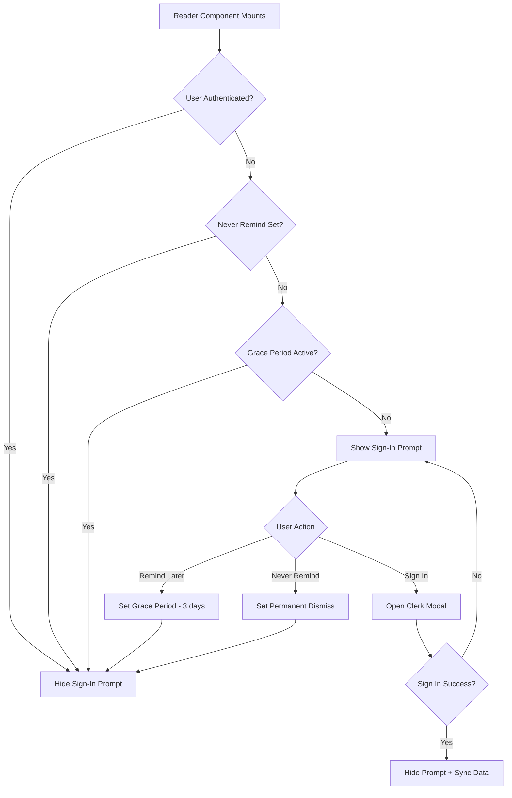
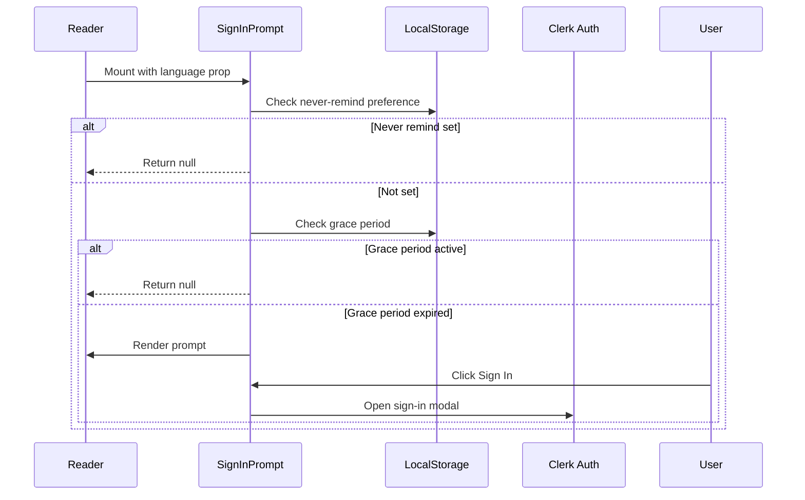

# Sign-In Prompt with "Never Remind Again" Option - Implementation Plan

## Overview

This document outlines the implementation plan for replacing the current backup reminder with a sign-in prompt that includes a "Never remind me again" option. The prompt will only appear when users are not signed in and haven't permanently dismissed the reminder.

## Current Implementation Analysis

### Backup Reminder Component

**File:** [`components/reader/backup-reminder.tsx`](components/reader/backup-reminder.tsx:1)

The current implementation:
- Uses an `Alert` component with amber/warning styling
- Checks if reminder should show via [`shouldShowBackupReminder()`](lib/backup-reminder.ts:42)
- Provides two actions: "Backup Now" and "Remind Later"
- "Remind Later" shows a confirmation dialog and dismisses for 3 days
- Supports 3 languages: simplified Chinese, traditional Chinese, and English

### Backup Reminder Utilities

**File:** [`lib/backup-reminder.ts`](lib/backup-reminder.ts:1)

Key functions and constants:
- `STORAGE_KEY_LAST_BACKUP = "life-study:last-backup"` - Stores last backup timestamp
- `STORAGE_KEY_BACKUP_REMINDER_DISMISSED = "life-study:backup-reminder-dismissed"` - Stores dismissal timestamp
- `DEFAULT_REMINDER_INTERVAL = 7 days` - Time between reminders
- `DISMISS_GRACE_PERIOD = 3 days` - Time before re-showing after dismiss

### Authentication State

**File:** [`hooks/use-sync.tsx`](hooks/use-sync.tsx:1)

Authentication is handled via Clerk:
- Uses [`useUser()`](hooks/use-sync.tsx:61) from `@clerk/nextjs`
- `isAuthenticated = isLoaded && !!user` (line 72)
- The [`useSync()`](hooks/use-sync.tsx:60) hook exposes `isAuthenticated` and `userId`

### Usage in Reader

**File:** [`components/reader/reader.tsx`](components/reader/reader.tsx:1928)

The backup reminder is rendered:
```tsx
<div className="mt-14 mx-auto max-w-2xl px-6">
  <BackupReminder language={language} />
</div>
```

### Sign-In UI Reference

**File:** [`components/home/cloud-sync-section.tsx`](components/home/cloud-sync-section.tsx:1)

Shows how sign-in UI is implemented:
- Uses `SignInButton` and `SignUpButton` from Clerk with `mode="modal"`
- Different UI for signed-in vs not-signed-in users

---

## Proposed Solution

### Architecture Diagram



### Component Flow



---

## Implementation Details

### 1. Create New Utility File: `lib/sign-in-prompt.ts`

**Purpose:** Handle all localStorage operations for the sign-in prompt preference.

**Storage Keys:**
```typescript
const STORAGE_KEY_SIGN_IN_PROMPT_DISMISSED = "life-study:sign-in-prompt-dismissed"
const STORAGE_KEY_SIGN_IN_NEVER_REMIND = "life-study:sign-in-prompt-never-remind"
```

**Functions to Implement:**

| Function | Description |
|----------|-------------|
| `shouldShowSignInPrompt()` | Returns true if prompt should be displayed |
| `dismissSignInPromptGrace()` | Sets grace period dismissal (3 days) |
| `setNeverRemindSignIn()` | Sets permanent dismissal flag |
| `clearNeverRemindSignIn()` | Clears permanent dismissal (for settings) |
| `isSignInPromptPermanentlyDismissed()` | Checks if never-remind is set |

### 2. Create New Component: `components/reader/sign-in-prompt.tsx`

**Purpose:** Display the sign-in prompt with three actions.

**Props Interface:**
```typescript
interface SignInPromptProps {
  language: Language
}
```

**UI Structure:**
```
┌─────────────────────────────────────────────────────────┐
│  🔐 Sign In to Sync                                    │
│                                                         │
│  Sign in to sync your reading progress, bookmarks,    │
│  highlights, and notes across all your devices.        │
│                                                         │
│  [Sign In]  [Remind Later]  [Never Remind Me Again]   │
│                                                         │
└─────────────────────────────────────────────────────────┘
```

**Multilingual Labels:**

| Key | Simplified | Traditional | English |
|-----|------------|-------------|---------|
| title | 登录同步 | 登入同步 | Sign In to Sync |
| description | 登录以在所有设备上同步您的阅读进度、书签、高亮和笔记。 | 登入以在所有裝置上同步您的閱讀進度、書籤、高亮和筆記。 | Sign in to sync your reading progress, bookmarks, highlights, and notes across all your devices. |
| signIn | 登录 | 登入 | Sign In |
| remindLater | 稍后提醒 | 稍後提醒 | Remind Later |
| neverRemind | 不再提醒 | 不再提醒 | Never Remind Me Again |
| remindLaterTitle | 稍后提醒 | 稍後提醒 | Remind Later |
| remindLaterDesc | 我们将在几天后再次提醒您登录。请注意，数据仅存储在您的浏览器本地，清除浏览器数据可能导致数据丢失。 | 我們將在幾天後再次提醒您登入。請注意，數據僅存儲在您的瀏覽器本地，清除瀏覽器數據可能導致數據丟失。 | We will remind you again in a few days. Note that data is stored locally in your browser. Clearing browser data may cause data loss. |
| neverRemindTitle | 不再提醒 | 不再提醒 | Never Remind |
| neverRemindDesc | 您确定不再接收登录提醒吗？您可以在设置中重新启用此提醒。 | 您確定不再接收登入提醒嗎？您可以在設定中重新啟用此提醒。 | Are you sure you do not want to be reminded to sign in? You can re-enable this reminder in settings. |
| cancel | 取消 | 取消 | Cancel |
| confirm | 确定 | 確定 | Confirm |

**Color Scheme:**
- Primary: Blue (vs amber for backup reminder)
- Icon: `LogIn` from lucide-react (instead of `AlertTriangle`)

### 3. Modify `components/reader/reader.tsx`

**Changes Required:**

1. Import the new component and auth hook:
```typescript
import { SignInPrompt } from "@/components/reader/sign-in-prompt"
import { useSync } from "@/hooks/use-sync"
```

2. Add authentication check:
```typescript
const { isAuthenticated } = useSync()
```

3. Replace the BackupReminder section:
```tsx
{/* Sign-In Prompt - only show when not authenticated */}
{!isAuthenticated && (
  <div className="mt-14 mx-auto max-w-2xl px-6">
    <SignInPrompt language={language} />
  </div>
)}
```

### 4. Settings Panel Update: `components/reader/settings-panel.tsx`

**Purpose:** Allow users to re-enable sign-in prompts if they previously chose "Never remind".

**New Section to Add:**
```
┌─────────────────────────────────────────┐
│ Sign-In Reminders                       │
│                                         │
│ [ ] Show sign-in reminders             │
│                                         │
│ Sign in to sync your data across       │
│ devices.                                │
└─────────────────────────────────────────┘
```

**Implementation:**
- Add toggle switch for sign-in reminders
- If toggled on, call `clearNeverRemindSignIn()`
- If toggled off, call `setNeverRemindSignIn()`

---

## File Changes Summary

| File | Action | Description |
|------|--------|-------------|
| `lib/sign-in-prompt.ts` | **Create** | New utility file for prompt state management |
| `components/reader/sign-in-prompt.tsx` | **Create** | New component for sign-in prompt UI |
| `components/reader/reader.tsx` | **Modify** | Replace BackupReminder with SignInPrompt |
| `components/reader/settings-panel.tsx` | **Modify** | Add toggle for sign-in reminders |
| `components/reader/backup-reminder.tsx` | **Optional: Delete** | Can be removed if no longer needed |
| `lib/backup-reminder.ts` | **Optional: Delete** | Can be removed if no longer needed |

---

## Storage Mechanism

### localStorage Keys

| Key | Type | Purpose |
|-----|------|---------|
| `life-study:sign-in-prompt-dismissed` | timestamp | When user clicked "Remind Later" |
| `life-study:sign-in-prompt-never-remind` | boolean | Permanent dismissal flag |

### Logic Flow for `shouldShowSignInPrompt()`

```
1. If never-remind flag is set → return false
2. If grace period is active (dismissed within 3 days) → return false
3. If user has no local data → return false (nothing to sync)
4. Otherwise → return true
```

### Data Check Function

```typescript
function hasLocalData(): boolean {
  // Check for reading states, bookmarks, highlights, notes
  for (let i = 0; i < localStorage.length; i++) {
    const key = localStorage.key(i)
    if (key && key.startsWith("life-study-reader:")) {
      return true
    }
  }
  return false
}
```

---

## UI/UX Design

### Visual Design

The sign-in prompt should:
- Use a **blue color scheme** (primary action color, not warning)
- Display a **LogIn icon** instead of warning triangle
- Have a **cleaner, more inviting design** than the backup reminder
- Use **modal dialogs** for "Remind Later" and "Never Remind" confirmations

### Button Hierarchy

| Button | Style | Purpose |
|--------|-------|---------|
| Sign In | Primary (filled blue) | Main CTA - opens Clerk modal |
| Remind Later | Outline | Secondary - sets 3-day grace period |
| Never Remind | Ghost/Subtle | Tertiary - permanent dismissal |

### Confirmation Dialogs

**Remind Later Dialog:**
- Title: "Remind Later"
- Description: Explains data is stored locally and will remind again
- Actions: Cancel / OK

**Never Remind Dialog:**
- Title: "Never Remind"
- Description: Explains they can re-enable in settings
- Actions: Cancel / Confirm

---

## Migration Considerations

### From Backup Reminder to Sign-In Prompt

The backup reminder and sign-in prompt serve different purposes:
- **Backup Reminder**: Encourages local backups (file download)
- **Sign-In Prompt**: Encourages cloud sync via authentication

**Decision:** The sign-in prompt should **replace** the backup reminder because:
1. Cloud sync is a superior solution for data preservation
2. Reduces notification fatigue (one prompt instead of two)
3. Aligns with modern app expectations

### Preserving Old Storage Keys

If we want to migrate existing backup reminder users:
```typescript
// On first load after update
const oldDismissed = localStorage.getItem("life-study:backup-reminder-dismissed")
const newDismissed = localStorage.getItem("life-study:sign-in-prompt-dismissed")
if (oldDismissed && !newDismissed) {
  localStorage.setItem("life-study:sign-in-prompt-dismissed", oldDismissed)
}
```

---

## Implementation Checklist

- [ ] Create `lib/sign-in-prompt.ts` with all utility functions
- [ ] Create `components/reader/sign-in-prompt.tsx` with UI and dialogs
- [ ] Update `components/reader/reader.tsx` to use new component
- [ ] Update `components/reader/settings-panel.tsx` with toggle option
- [ ] Add tests for utility functions
- [ ] Test all three language variations
- [ ] Test Clerk sign-in modal integration
- [ ] Test localStorage persistence
- [ ] (Optional) Remove backup reminder files if confirmed

---

## Questions for Clarification

Before implementation, please confirm:

1. **Should the backup reminder be completely removed?** Or should both prompts coexist?
2. **Should we migrate existing backup reminder dismissals?** Users who dismissed the backup reminder might have already expressed "don't bother me" sentiment.
3. **What should be the grace period?** The backup reminder uses 3 days. Is this appropriate for sign-in prompts too?
4. **Should the prompt appear on every page load?** Or only on certain conditions (e.g., after user has reading activity)?