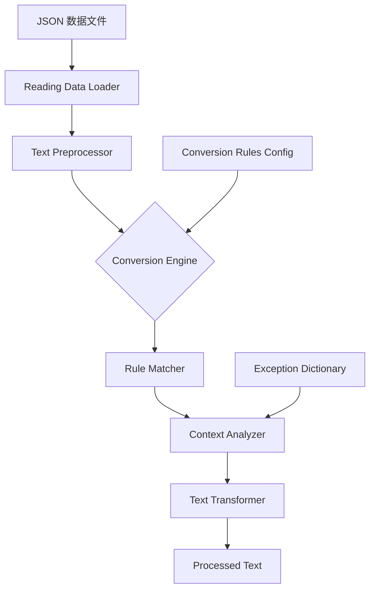

# 繁简转换动态修正系统计划

## 概述

本项目旨在创建一个动态文本处理系统，在运行时修正 Traditional-to-Simplified Chinese 转换遗留问题，确保文本符合标准简体中文语境与表达习惯。

---

## 一、已发现的转换问题清单

### 1. 一对多映射错误

| 繁体字 | 当前错误转换 | 正确转换 | 说明 |
|--------|-------------|----------|------|
| 為著 | 为著 | **为着** | 介词用法 |
| 甚麼 | 甚么 | **什么** | 疑问代词 |
| 裏/裡 | 里 | **里** | 方位词已正确，需检查上下文 |
| 乾 | 干 | **干/乾** | 需根据语境判断（乾燥→干燥，乾坤→乾坤） |
| 后 | 后 | **后/后** | 已正确（皇后→皇后，後来→后来） |

### 2. 异体字未标准化

| 异体字 | 标准简体 | 出现频率 | 示例 |
|--------|----------|----------|------|
| 彀 | 够 | 高 | 彀用→够用 |
| 罢 | 罢 | 高 | 罢了→罢了 |
| 纔 | 才 | 高 | 纔能→才能 |
| 喫 | 吃 | 中 | 喫饭→吃饭 |
| 迴 | 回 | 中 | 迴转→回转 |
| 甦 | 苏 | 中 | 复甦→复苏 |
| 籲 | 吁 | 低 | 呼籲→呼吁 |
| 磐 | 盘 | 低 | 磐石→盘石（保留磐石也可） |
| 搆 | 构 | 低 | 搆成→构成 |

### 3. 词汇标准化问题

| 原词 | 标准简体 | 类别 |
|------|----------|------|
| 豫表 | 预表 | 宗教术语 |
| 豫备 | 预备 | 常用词 |
| 豫言 | 预言 | 常用词 |
| 豫定 | 预定 | 常用词 |
| 表显 | 表显 | 可保留或改为表现 |
| 荣燿 | 荣耀 | 常用词 |
| 争战 | 争战 | 可保留，宗教语境常用 |

### 4. 代词转换问题

| 原字 | 转换建议 | 说明 |
|------|----------|------|
| 牠 | 它 | 用于动物/无生命物体，但圣经文本中"牠"常指魔鬼，可考虑保留以示区分 |

### 5. 语境相关转换

某些词汇需要根据上下文判断：
- "著" 字：作为助词时→"着"（为着、说着），作为动词时保留（著作、著名）
- "干" 字：干燥→干燥，干预→干预，乾坤→乾坤
- "发" 字：发展→发展，头发→头发

---

## 二、转换规则映射表

### 核心转换规则

```typescript
const CONVERSION_RULES = {
  // 一对多映射修正
  oneToMany: {
    '为著': '为着',
    '甚麼': '什么',
    '甚么': '什么',
  },
  
  // 异体字标准化
  variantChars: {
    '彀': '够',
    '纔': '才',
    '喫': '吃',
    '迴': '回',
    '甦': '苏',
    '籲': '吁',
    '罷': '罢',
  },
  
  // 词汇标准化
  vocabulary: {
    '豫表': '预表',
    '豫备': '预备',
    '豫言': '预言',
    '豫定': '预定',
    '豫防': '预防',
    '榮燿': '荣耀',
    '榮耀': '荣耀', // 已是简体但繁体写法不同
  },
  
  // 语境相关规则（需要正则匹配）
  contextRules: [
    {
      pattern: /(?<![著作])著(?![名])/g,
      replacement: '着',
      description: '非"著作"、"著名"等情况下的"著"转换为"着"'
    },
    {
      pattern: /牠(?!们)/g,
      replacement: '它',
      description: '单独使用的"牠"转换为"它"（可根据需要禁用）'
    }
  ]
};
```

---

## 三、系统架构设计

### 整体架构图



### 模块设计

#### 1. 转换引擎 (Conversion Engine)

```typescript
// lib/converter.ts 结构示意

interface ConversionRule {
  type: 'one-to-one' | 'one-to-many' | 'context' | 'variant';
  source: string | RegExp;
  target: string;
  description?: string;
  enabled?: boolean;
}

class ChineseTextConverter {
  private rules: ConversionRule[];
  private exceptionDict: Set<string>;
  
  constructor(config: ConversionConfig) {
    this.loadRules(config);
    this.loadExceptions(config.exceptions);
  }
  
  convert(text: string): string {
    // Apply rules in order
    let result = text;
    for (const rule of this.rules) {
      if (rule.enabled !== false) {
        result = this.applyRule(result, rule);
      }
    }
    return result;
  }
  
  private applyRule(text: string, rule: ConversionRule): string {
    // Implementation
  }
}
```

#### 2. 集成点

与现有 [`lib/reading-data.ts`](lib/reading-data.ts) 集成：

```typescript
// 修改 reading-data.ts 中的数据加载逻辑

import { ChineseTextConverter } from './converter';

const converter = new ChineseTextConverter(defaultConfig);

export async function getReadingData(bookId: string) {
  const data = await loadJsonFile(`src/data/life-study/${bookId}.json`);
  
  // 动态转换文本
  return {
    ...data,
    content: data.content.map(item => ({
      ...item,
      text: converter.convert(item.text)
    }))
  };
}
```

---

## 四、实现步骤

### Phase 1: 核心转换模块

1. 创建 [`lib/converter.ts`](lib/converter.ts) 文件
2. 实现基础转换规则映射
3. 添加语境分析功能

### Phase 2: 规则配置

1. 创建 [`lib/conversion-rules.ts`](lib/conversion-rules.ts) 配置文件
2. 整理完整的转换规则列表
3. 添加异常词汇字典

### Phase 3: 集成测试

1. 修改 [`lib/reading-data.ts`](lib/reading-data.ts) 集成转换器
2. 添加转换结果缓存机制（性能优化）
3. 编写单元测试

### Phase 4: 可选功能

1. 创建转换日志系统（记录所有转换）
2. 添加用户自定义规则支持
3. 实现批量转换验证工具

---

## 五、性能考量

### 缓存策略

由于转换是动态进行的，需要实现缓存以避免重复处理：

```typescript
const conversionCache = new Map<string, string>();

function convertWithCache(text: string, hash: string): string {
  if (conversionCache.has(hash)) {
    return conversionCache.get(hash)!;
  }
  const result = converter.convert(text);
  conversionCache.set(hash, result);
  return result;
}
```

### 按需转换

- 只在首次访问时转换
- 可考虑构建时预处理并存储转换后的版本

---

## 六、测试计划

### 测试用例

```typescript
describe('ChineseTextConverter', () => {
  test('should convert 為著 to 为着', () => {
    expect(converter.convert('為著對召會敗落之豫防劑')).toBe('为着对召会败落之预防剂');
  });
  
  test('should convert 甚麼 to 什么', () => {
    expect(converter.convert('你看這是甚麼')).toBe('你看这是什么');
  });
  
  test('should convert variant characters', () => {
    expect(converter.convert('彀用')).toBe('够用');
    expect(converter.convert('纔能')).toBe('才能');
  });
  
  test('should preserve 著 in 著作', () => {
    expect(converter.convert('這是一本著作')).toBe('这是一本著作');
  });
  
  test('should handle 豫系列 words', () => {
    expect(converter.convert('豫表豫言豫備')).toBe('预表预言预备');
  });
});
```

---

## 七、部署检查清单

- [ ] 所有转换规则已验证
- [ ] 单元测试覆盖率 > 90%
- [ ] 性能测试通过（转换延迟 < 10ms）
- [ ] 与现有系统集成无冲突
- [ ] 文档完整

---

## 八、后续维护

1. **新增规则**：当发现新的转换问题时，在 [`conversion-rules.ts`](lib/conversion-rules.ts) 中添加
2. **异常处理**：如发现误转换，添加到异常字典
3. **版本追踪**：使用语义化版本号管理规则更新

---

## 附录：完整词汇对照表

（待实现时补充完整列表）